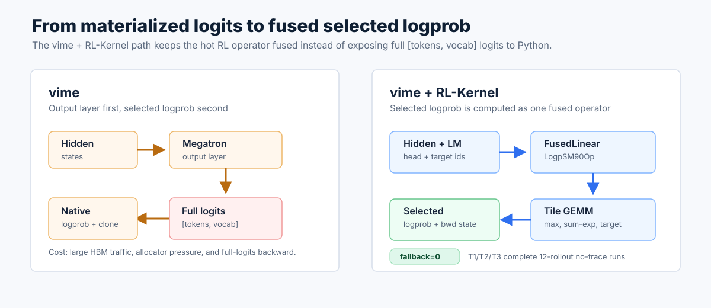
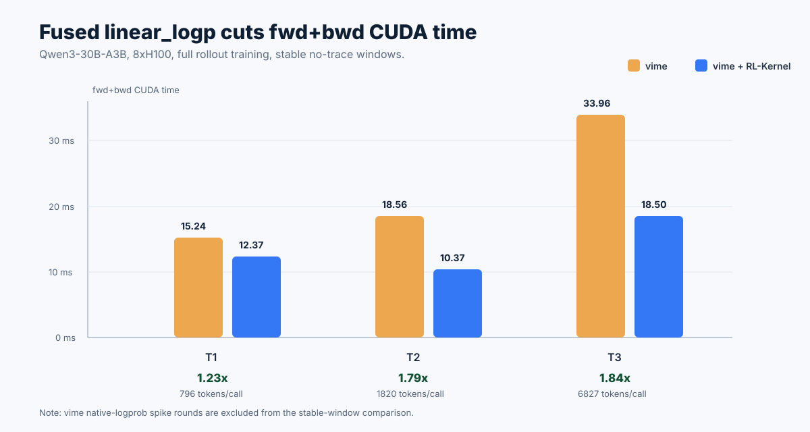
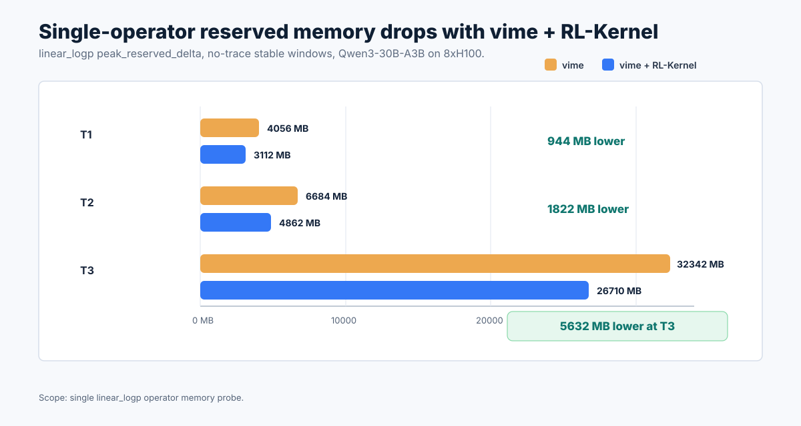

Today we are introducing the [**RL-Kernel**](https://github.com/RL-Align/RL-Kernel) `linear_logp` integration for [**vime**](https://github.com/vllm-project/vime), a fused operator path for LLM RL post-training workloads. The integration replaces the native output-layer plus selected-logprob path with a Hopper-optimized CUDA operator that computes the selected token log probability directly from hidden states and the LM head weights.

On Qwen3-30B-A3B with 8xH100 80GB, full vLLM rollout, Megatron training, TP=2, PP=1, CP=1, EP=8, and 12 rollout rounds, the vime + RL-Kernel path completed the T1, T2, and T3 configurations with zero fallback. In the largest completed no-trace configuration, the fused `linear_logp` forward plus backward CUDA time dropped from **33.96 ms** to **18.50 ms** (**1.84x faster**), while the single-operator peak reserved delta dropped from **32342 MB** to **26710 MB**.

## Our Vision

RL post-training is increasingly limited by the boundaries between training, rollout, and framework-level tensor materialization. vime already gives developers a clean training and rollout pipeline, connecting Megatron training with vLLM-powered generation. RL-Kernel focuses on a narrower but critical layer: the operators that decide whether a full RL step is memory-heavy, latency-sensitive, and numerically predictable.

The selected-logprob path is one of the most important examples. PPO, GRPO, and related algorithms only need log probabilities for selected tokens, yet the conventional path often materializes full `[tokens, vocab]` logits before applying logprob utilities. For large-vocabulary MoE models, that tensor can dominate both HBM traffic and allocator pressure.

RL-Kernel's goal is to make these RL-specific operators first-class infrastructure: fused, observable, tensor-parallel aware, and easy to plug into production-style training systems without rewriting the orchestration layer.

## Positioning

vime remains the RL framework and orchestration layer. It manages training, rollout, weight synchronization, data flow, and algorithm-level execution. RL-Kernel sits underneath that layer as an operator library.

For this integration, vime keeps the same high-level workflow:

- Megatron runs the training side.
- vLLM runs the rollout side.
- vime coordinates weight updates, samples, rewards, and train-rollout metrics.
- RL-Kernel replaces the training-side `linear_logp` hot path when the configured backend is available.

This makes the integration deliberately non-intrusive. If the fused operator path is not enabled, vime can still use the native output layer and native selected-logprob implementation. When RL-Kernel is enabled and the fast path is hit, the training side avoids materializing full logits for selected-logprob computation.

RL-Kernel is not designed around a single path for every workload. Instead, operator paths should be observable and selectable: validated shape, hardware, and dtype combinations can use a performance-oriented fast path, while tasks that put rollout-training consistency first can use a consistency-first path. These goals are complementary. This first integration validates the `linear_logp` fast path inside the full vime workflow; future work will expand both consistency coverage and performance coverage under the same visible selection and fallback model.

## Architecture Overview

RL-Kernel is designed as an operator-layer bridge between high-level RL orchestration and low-level GPU backends. It integrates with rollout engines and training engines through custom operator hooks, while the actual kernels are implemented through CUDA, Triton, ROCm, and related backend libraries.

<p align="center">

<br>
<em>RL-Kernel sits at the operator layer between RL orchestration frameworks and hardware-specific kernel backends. This is the architecture diagram from the RL-Kernel README.</em>
</p>

For `linear_logp`, the vime integration follows this path:

- vime extracts the LM head weight, TP group, local vocab range, and global vocab size from the Megatron model.
- During the vime + RL-Kernel training forward pass, vime asks Megatron to return hidden states instead of materialized logits.
- vime passes hidden states, target token IDs, and tensor-parallel metadata to RL-Kernel.
- RL-Kernel dispatches `FusedLinearLogpSM90Op` and hits the fused-tile bf16 full-gradient tensor-parallel fast path.
- The CUDA extension computes selected logprob and the state needed for backward without exposing a full `[tokens, vocab]` logits tensor to the Python framework layer.

<p align="center">

<br>
<em>The vime path materializes full logits; the vime + RL-Kernel path fuses selected-logprob computation into the operator layer.</em>
</p>

## Key Capabilities

- **Fused selected-logprob computation**: In the forward pass, RL-Kernel computes `log_softmax(hidden @ W^T)[target]` without materializing full logits at the framework layer.
- **SM90 tensor-parallel fast path**: The completed 8xH100 runs hit the fused-tile bf16 full-gradient tensor-parallel path on Hopper.
- **Full-gradient support**: The main result uses `TRAIN_SCOPE=full`, with gradients for the relevant hidden and weight path rather than an output-layer-only shortcut.
- **Observable fallback behavior**: Each completed vime + RL-Kernel run reports `fallback=0`, making it clear that the published numbers come from the fused path.
- **vime-compatible execution**: The benchmark uses full vLLM rollout and Megatron training, not a train-only microbenchmark.

## Validation and Benchmarks

The main validation used Qwen3-30B-A3B on 8xH100 80GB with full rollout training. All published metrics below come from complete 12-rollout no-trace runs. The stable statistics use rollout 3-11 to avoid warmup effects.

The vime path is the native Megatron output layer plus native selected-logprob computation. The vime + RL-Kernel path is `FusedLinearLogpSM90Op` in the `save-logits` fused-tile full-gradient path.

### Qwen3-30B-A3B on 8xH100

T1, T2, and T3 all completed 12 rollouts for both vime and vime + RL-Kernel. The vime + RL-Kernel runs hit:

```text
Using RL-Kernel linear_logp op: FusedLinearLogpSM90Op
Using fused-tile bf16 full-gradient tensor-parallel linear_logp fast path.
```

and reported `fallback=0`.

| Config | Tokens/call | fwd CUDA vime | fwd CUDA vime + RL-Kernel | fwd speedup | fwd+bwd CUDA vime | fwd+bwd CUDA vime + RL-Kernel | fwd+bwd speedup |
| --- | ---: | ---: | ---: | ---: | ---: | ---: | ---: |
| T1 | 796 | 5.14 ms | 3.51 ms | 1.46x | 15.24 ms | 12.37 ms | 1.23x |
| T2 | 1820 | 7.78 ms | 3.36 ms | 2.32x | 18.56 ms | 10.37 ms | 1.79x |
| T3 | 6827 | 14.52 ms | 7.62 ms | 1.91x | 33.96 ms | 18.50 ms | 1.84x |

The strongest single-operator result is T3: the forward plus backward CUDA time drops from **33.96 ms** to **18.50 ms**. T2 shows the best forward-only speedup at **2.32x**.

<p align="center">

<br>
<em>vime + RL-Kernel reduces forward plus backward CUDA time across the completed no-trace configurations.</em>
</p>

### Single-Operator Memory

The memory comparison also uses operator-level probes. It tracks the peak reserved delta around the `linear_logp` call.

| Config | reserved delta vime | reserved delta vime + RL-Kernel | single-op reserved saving |
| --- | ---: | ---: | ---: |
| T1 | 4056 MB | 3112 MB | 944 MB |
| T2 | 6684 MB | 4862 MB | 1822 MB |
| T3 | 32342 MB | 26710 MB | 5632 MB |

T3 is the clearest single-operator memory result: the peak reserved delta drops from **32342 MB** to **26710 MB**, saving **5632 MB** during the `linear_logp` operator window.

<p align="center">

<br>
<em>The memory comparison is scoped to the `linear_logp` operator, matching the timing comparison.</em>
</p>

### End-to-End Step Time Scope

The current results are primarily operator-level gains for `linear_logp`: lower CUDA time and lower peak reserved memory. In the largest no-trace stable window, full step time moved from **232.20s** to **228.40s**, a modest **1.6%** improvement; in the same window, full-run peak reserved memory dropped from **49.26GB** to **46.23GB**, saving about **3.03GB**. Because a full RL step also includes rollout, weight sync, TP/NCCL communication, and framework scheduling, we do not claim this release as a significant end-to-end step-time speedup. This is the first-stage vime + RL-Kernel integration; future work will expand to more RL hot paths and communication-aware / TP-aware operators, with additional end-to-end experiments.

### Stability and Sanity Signals

The completed vime + RL-Kernel runs preserve the expected training signals. Losses remain finite, rewards remain in the same range as vime, and train-rollout logprob differences stay in the same order of magnitude.

| Config | raw_reward vime | raw_reward vime + RL-Kernel | abs_diff vime | abs_diff vime + RL-Kernel | fallback |
| --- | ---: | ---: | ---: | ---: | ---: |
| T1 | 0.0000 | 0.0000 | 0.02668 | 0.02537 | 0 |
| T2 | 0.0278 | 0.0278 | 0.02264 | 0.02395 | 0 |
| T3 | 0.1111 | 0.0972 | 0.02034 | 0.02224 | 0 |

The table follows the same stable rollout 3-11 window used throughout this benchmark, focusing the comparison on repeatable single-operator behavior.

### Why the Fused Path Wins

The native path is two-stage:

```text
hidden -> output_layer -> full logits -> selected logprob
```

The vime + RL-Kernel path changes the operator boundary:

```text
hidden + lm_head_weight + target_ids -> selected logprob
```

This matters for four reasons.

First, vime + RL-Kernel avoids exposing full `[tokens, vocab]` logits as a framework-level forward intermediate. For T3, each call covers roughly 6.8k packed tokens, so removing that framework-level logits tensor saves substantial memory traffic and allocator pressure.

Second, the CUDA kernel can maintain max, sum-exp, and target-logit statistics while performing tiled GEMM work. It does not need to wait for an entire logits matrix before starting logprob computation.

Third, the tensor-parallel metadata is explicit. RL-Kernel receives the TP group, local vocab start index, and global vocab size, allowing each rank to work on its local vocab shard and combine only the statistics needed for the global selected logprob.

Fourth, full-gradient backward also moves onto a faster path. RL-Kernel organizes local or tiled logits/dlogits and linear-gradient work in CUDA/C++, trading a controlled workspace for fewer Python chunk loops, fewer small matmul dispatches, and lower allocator churn. In the measured operator window, this latency-oriented design still keeps peak reserved memory below the vime path.

## Roadmap

For the detailed integration plan, see the [RL-Kernel and vime Integration Roadmap](RL-Kernel-vime-integration-roadmap.md).

RL-Kernel and vime will continue to evolve along several practical directions:

- **Consistency contracts**: make rollout-training `dlogp`, provenance, batch-invariance checks, and strict/audit modes first-class vime diagnostics.
- **Fast-path expansion**: extend contract-preserving RL-Kernel backends beyond `linear_logp` only where profiling shows real bottlenecks.
- **Compute/communication decoupling**: separate compute kernels, collective scheduling, and overlap telemetry so TP/NCCL bottlenecks can be optimized without hiding numeric-contract changes.
- **Operator coverage**: add targeted paths for logprob reference scoring, attention/reductions, matmul projections, normalization, embeddings, and RL loss fragments.
- **Release discipline**: keep operator-level, actor-window, and full-step claims separate, with structured fallback reporting and reproducible benchmark slices.

## Quick Start

The 8xH100 benchmark entry point is:

```bash
cd /workspace/vime
WORKSPACE_ROOT=/workspace \
VIME_PYTHON_ENV=/workspace/vime-rlk-env \
TRACE_MODE=none \
TRAIN_SCOPE=full \
scripts/benchmarks/run-qwen3-30B-A3B-8gpu-rlk-12rollout.sh T3 cuda
```

The key vime + RL-Kernel settings are:

```bash
export VIME_RL_KERNEL=1
export VIME_RL_KERNEL_OPS=linear_logp
export VIME_RL_KERNEL_LINEAR_LOGP_BACKEND=cuda
export VIME_RL_KERNEL_CUDA_EVENT_TIMER=1
export VIME_RL_KERNEL_LINEAR_LOGP_DETACH_HIDDEN=0
export RL_KERNEL_LINEAR_LOGP_SAVE_PROBS_BF16=0
export RL_KERNEL_LINEAR_LOGP_FUSED_TILE_BWD_FULL=1
```

Before collecting numbers, confirm that the RL-Kernel CUDA extension exposes the SM90 forward and backward symbols, and verify in logs that the vime + RL-Kernel path hits the fused-tile fast path with `fallback=0`.

## Join the Community

RL-Kernel is open source and focused on practical operator infrastructure for RL post-training.

- **RL-Kernel code and docs**: [github.com/RL-Align/RL-Kernel](https://github.com/RL-Align/RL-Kernel)
- **vime code and docs**: [github.com/vllm-project/vime](https://github.com/vllm-project/vime)
- **Feedback**: Issues, PRs, benchmark results, and hardware reports are welcome.

If you are running large RL post-training jobs and seeing selected-logprob or output-layer memory pressure, RL-Kernel is a good place to start looking.

## Acknowledgments

This work builds on vime, vLLM, Megatron-LM, FlashInfer, DeepSpeed, and the broader open-source RL infrastructure ecosystem. We thank the vime and RL-Kernel contributors who helped validate the 8xH100 long-run setup, debug the rollout and weight-sync path, and keep the published benchmark numbers tied to complete no-trace runs rather than isolated microbenchmarks.
