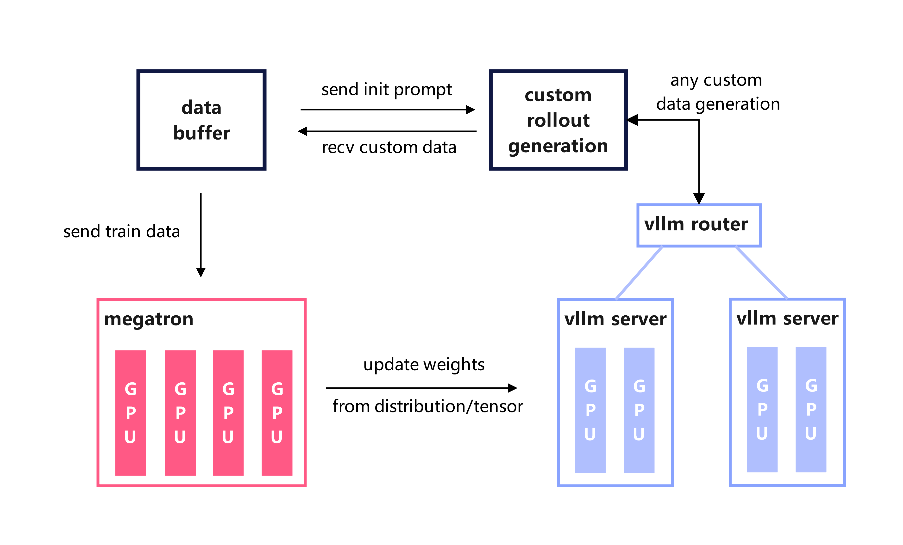

# Vime

[English](./README.md) · [代码仓库](https://github.com/vllm-project/vime)

**Vime** 是面向 RL scaling 的 LLM post-training 框架。它保留高吞吐训练栈与灵活的数据生成设计，同时默认以 [**vLLM**](https://github.com/vllm-project/vllm)（配合 [vllm-router](https://github.com/vllm-project/router)）作为 rollout 后端，替代 SGLang。Vime 提供两大核心能力：

1. **高性能训练**：通过连接 Megatron 与 vLLM，支持各种模式的高效训练；
2. **灵活的数据生成**：通过自定义数据生成接口以及 server based engine，实现任意的训练数据生成流程。

Vime 支持广泛的模型系列，包括：

- Qwen 系列（Qwen3.6、Qwen3.5、Qwen3Next、Qwen3MoE、Qwen3、Qwen2.5）；
- DeepSeek V3 系列（DeepSeek V3、V3.1、DeepSeek R1）；
- Llama 3。

## 目录

- [架构总览](#架构总览)
- [快速开始](#快速开始)
- [参数说明](#参数说明)
- [开发指南](#开发指南)
- [Vime 文档](#vime-文档)
- [常见 Q&A 与致谢](#常见-qa-与致谢)

## 架构总览



**模块说明**：

- **training (Megatron)**：负责主训练流程，从 Data Buffer 读取数据，训练完后将参数同步至 rollout 模块；
- **rollout (vLLM + router)**：启动 vLLM 推理引擎并路由生成请求，产出新数据（含 reward/verifier），存储至 Data Buffer；
- **data buffer**：桥梁模块，管理 prompt 初始化、自定义数据与 rollout 生成方法。

## 快速开始

有关环境配置、数据准备、训练启动和关键代码分析的完整快速开始指南，请参考：

- [快速开始指南](./docs/zh/get_started/quick_start.md)

我们还提供了一些未在快速开始中覆盖的使用示例，请查看 [examples](examples/)。

## 参数说明

Vime 的参数分为三类：

1. **Megatron 参数**：Vime 会读取 Megatron 中的全部参数，可通过传入如 `--tensor-model-parallel-size 2` 的方式配置 Megatron；
2. **vLLM 参数**：vLLM server 与 engine 相关选项以 `--vllm-` 为前缀（例如 `--vllm-gpu-memory-utilization`）。路由相关选项分两类前缀：vllm-router 自身的选项以 `--router-` 传入（例如 `--router-policy round_robin`、`--router-request-timeout-secs`），Vime 侧用于告诉 Vime *router 在哪里* 的编排参数则以 `--vllm-router-` 为前缀（`--vllm-router-ip`、`--vllm-router-port`）。完整参数见 [vime/backends/vllm_utils/arguments.py](vime/backends/vllm_utils/arguments.py)。
3. **框架参数**：与 Vime 编排相关的开关（rollout GPU、数据路径、RL 算法等），见 [vime/utils/arguments.py](vime/utils/arguments.py)。

`--rollout-num-gpus-per-engine` 对应每个 vLLM engine 的 tensor parallel size。默认 rollout 入口为 `vime.rollout.vllm_rollout.generate_rollout`。

完整使用说明请查阅 [使用文档](docs/zh/get_started/usage.md)。

## 开发指南

- **欢迎贡献！** 若有功能建议、性能调优或使用体验反馈，欢迎提交 Issue / PR。

- 使用 [pre-commit](https://pre-commit.com/) 保证提交代码风格：

  ```bash
  apt install pre-commit -y
  pre-commit install

  # 运行 pre-commit 保证代码风格
  pre-commit run --all-files --show-diff-on-failure --color=always
  ```

- 调试技巧请参考 [debug 指南](docs/zh/developer_guide/debug.md)

## Vime 文档

以下资源覆盖 Vime 使用方式、Megatron 集成、定制化与高级主题：

[](https://vllm-project.github.io/vime/)
[](https://deepwiki.com/vllm-project/vime)

- 代码仓库：[vllm-project/vime](https://github.com/vllm-project/vime)
- 本仓库英文文档：[docs/en/](docs/en/)
- 本仓库中文文档：[docs/zh/](docs/zh/)

## 常见 Q&A 与致谢

- 常见问题请见 [Q&A](docs/zh/get_started/qa.md)
- 特别感谢 **vLLM** 项目与 **slime** 社区，以及 Vime 所依赖的 Megatron-LM 等开源项目。

引用 Vime 请使用：

```bibtex
@misc{vime,
  author       = {Vime Contributors},
  title        = {Vime: An LLM post-training framework with vLLM for RL Scaling},
  year         = {2026},
  howpublished = {\url{https://github.com/vllm-project/vime}},
  note         = {GitHub repository.},
  urldate      = {2026-05-25}
}
```
