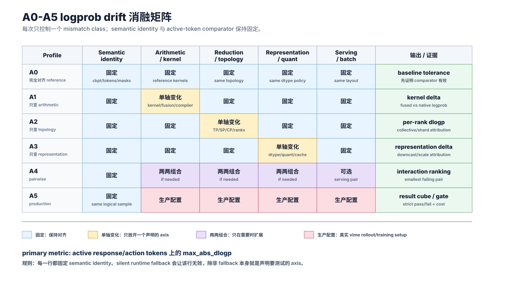
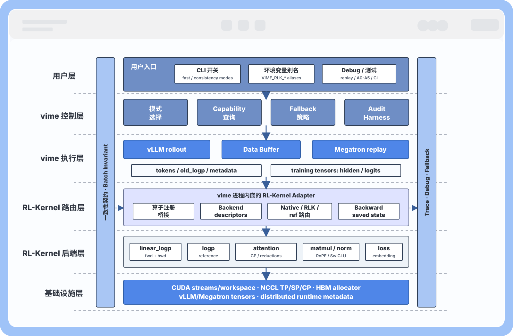

# RL-Kernel 与 vime 集成 Roadmap

这份 Roadmap 面向 vime 与 RL-Kernel 的实际集成。基本边界保持不变：vime 继续负责 RL orchestration，包括 Megatron training、vLLM rollout、Data Buffer、reward flow、weight sync、调度和算法级行为；RL-Kernel 作为可选、可观测的算子后端，提供两类能力：

1. **Fast Path**：在后端满足条件时，降低 vime RL 训练中的算子级和系统级开销。
2. **Consistency Path**：把 rollout-training 训推一致性做成可测量、可诊断、可强制的 numeric contract。

这两件事相关，但不天然兼容。一个 fast backend 只有在保留同一份 numeric contract 时，才能进入 strict consistency；否则只能用于 `audit`，或者必须 fallback。

## 摘要

vime 把 vLLM rollout 和 Megatron training 接在一起，这正好是解决两个问题的位置：

- **性能问题**：完整 RL step 不只受 selected-logprob 算子影响，还受 TP/NCCL 通信、rank skew、host-side scheduling、GPU idle、weight sync，以及大量小框架 kernel 影响。
- **训推一致性问题**：参数更新之前，rollout 侧记录的 log probability 与 training 侧 teacher-forcing 重算的 log probability，应该在同一个 checkpoint、同一批 token、同一个 active mask、同一个 tokenizer、同一套 padding 语义、同一套 sampling metadata、同一套 position/cache metadata、同一套 quantization 设置和同一份 numeric contract 下对齐。

已经完成的 `linear_logp` 集成证明了边界是可行的：vime 保持 orchestration，让 Megatron 返回 hidden states；RL-Kernel 从 hidden states、LM head weight、target ids 和 TP metadata 直接计算 selected logprob，不在 Python framework layer 暴露完整 logits。

这份 Roadmap 把训推一致性 contract 落到 vime 框架中：每个算子要说明 vime 记录什么、在哪里调用、哪些 metadata 跟着 rollout sample 走、RL-Kernel 汇报什么 capability、怎么 fallback，以及 strict mode 要检查哪些 contract。

## 用户侧开关

推荐公开接口：

```bash
--rlk-fast {off,auto,strict}
--rlk-consistency {off,audit,strict}
```

环境变量别名：

```bash
VIME_RLK_FAST=off|auto|strict
VIME_RLK_CONSISTENCY=off|audit|strict
```

和现有接口的兼容关系可以是：

- `--enable-rl-kernel` 等价于 `--rlk-fast auto`。
- `--rl-kernel-strict` 对 enabled operators 映射为 `--rlk-fast strict`。
- `--rl-kernel-ops linear_logp,...` 继续作为算子 allowlist。
- `--rlk-consistency audit` 可以在不开加速时运行，用来测量 native vime 的 rollout-training drift。

两类开关保持正交：

| `--rlk-fast` | `--rlk-consistency` | 行为 |
|---|---|---|
| `off` | `off` | vime native 行为。 |
| `auto` | `off` | 满足条件时使用已验证 RL-Kernel 优化算子；否则 warning 并 fallback。 |
| `strict` | `off` | 强制使用 enabled RL-Kernel 优化算子；不可用时 error。 |
| `off` | `audit` | 仍走 vime native execution，但计算并记录 consistency diagnostics。 |
| `off` | `strict` | 要求 metadata 和 contract checks 完整；mismatch 时 fail。 |
| `auto` | `audit` | 满足条件时使用优化算子，同时报告 consistency metrics。 |
| `auto` | `strict` | 只使用满足 consistency contract 的优化算子；否则走 contract-preserving reference execution，或按 policy fail。 |
| `strict` | `strict` | 对 enabled operators 同时要求 acceleration support 和 strict consistency support。 |

## Consistency Contract

核心指标：

```text
dlogp = training-side recomputed logp - rollout-side old logp
```

这个指标只有在以下前提一致时才有意义：

- 同一个 checkpoint 或 weight version；
- 被比较样本的 token IDs 相同；
- 被比较样本的 active response/action mask 相同；
- 同一个 tokenizer 和 padding semantics；
- 同一个参数更新前状态；
- 同一套 sampling metadata，包括 temperature、top-p、top-k；
- 同一套 position IDs 和 KV/cache metadata；
- 同一套 quantization configuration；
- 同一份 operator numeric contract，包括 accumulation dtype、reduction order、downcast point、sharding semantics，以及 attention LSE 这类特殊 merge semantics；
- 当 batch composition 会影响 tiling、padding、packing、split-K、cache layout 或 reduction order 时，还要满足同一份 batch-invariance contract。

所有 metrics 只在 active response/action tokens 上计算。Prompt tokens、padding tokens，以及被 mask 掉的 response positions，都不进入任何 aggregate metric。training-side value 必须来自对已经 sampled rollout sequence 的 teacher-forcing scoring；audit path 不应 resample 或 regenerate tokens。

strict pass/fail gate 应使用 RL-Kernel 的 per-dtype tolerance contract 作为唯一阈值来源，并以 active tokens 上的 `max_abs_dlogp` 作为 primary thresholded metric。vime 不应在自己的 docs 或 configs 里复制 numeric tolerance values。`ratio0`、`clipfrac0`、`approx_kl0` 和 percentile metrics 是 diagnostics / triage signals，不能替代 selected-token `dlogp` contract。

Batch invariance 是 strict consistency 的一部分。对同一个 sample/token，只要 sample-level inputs 和声明的 contract 不变，它单独被打分、混入不同 batch、使用不同 padding、采用不同 packing 顺序、落入不同 microbatch，或者处在不同 dynamic-sampling group 中时，recomputed logp 和训练梯度贡献都不应该变化。如果某个 optimized backend 会根据 batch composition 改变数学路径，它仍然可以用于 `off` 或 `audit`，但在 batch-invariance contract 验证前不应宣称支持 `strict`。

batch-invariance claim 分两层：

- **End-to-end strict consistency**：same-sample `dlogp` 在覆盖的 batch-layout matrix 中必须保持在 per-dtype tolerance 内。这是默认 production contract。
- **Deterministic operator claim**：如果 RL-Kernel backend 宣称 deterministic/batch-invariant `logp`，则必须证明 identical input bytes 在 batch size、row position、dense vs indexed rows、sparse-row density、stream/repeat runs、GPU architecture 和 build fingerprint 相同的情况下具备 same-backend bitwise stability。Cross-backend 或 cross-platform parity 可以保持 tolerance-based，除非另有单独 bitwise contract。

最小诊断面：

- `abs_dlogp` mean、max、p50、p90、p99；
- `ratio0 = exp(dlogp)`；
- `clipfrac0`；
- `approx_kl0 = mean(exp(dlogp) - 1 - dlogp)`；
- active token count 和 mask coverage；
- batch layout fingerprint，包括 batch shape、sequence lengths、padding side、packed order、active-mask density、microbatch/global-batch 标识、rollout ID，以及可用时的 dynamic-sampling group；
- distributed run 的 per-rank 版本；
- 可用时的 per-operator / per-stage attribution；
- maximum absolute drift 的 worst-token metadata，包括可用时的 sample ID、token position、rank、model name 和 backend contract ID；
- checkpoint、tokenizer、sampling config、mask/padding semantics、position/cache metadata、quantization、numeric contract 的 metadata fingerprint。

这个 contract 也决定了推进顺序：先单卡 operator comparison，再 distributed operator comparison，最后才是 communication / topology sweep。对应算子的单卡对拍没过之前，不能把多卡 drift 归因给通信。

## Drift Taxonomy 与 Alignment Strategy

consistency plan 应先分类 drift，再谈 fix。建议区分以下来源：

- **Logical input and metadata drift**：checkpoint/version、tokenizer、token IDs、masks、padding side、position IDs、packed sequence metadata、cache positions、request formatting 或 model routing 不一致。这类问题会让 comparison 失效。
- **Arithmetic schedule drift**：rollout 和 training 用不同 kernel、fusion order、compiler rewrite、attention backend、matmul epilogue 或 accumulation dtype 计算等价表达式。
- **Reduction and collective drift**：local reductions、TP/SP/CP collectives、all-reduce、reduce-scatter、sharded logits、custom all-reduce 或 rank topology 改变 floating-point reduction order。
- **Representation drift**：rollout 和 training 使用不同 dtype、quantization、dequantization、KV-cache precision、scale/group-size policy 或 downcast point。
- **Serving and execution drift**：router policy、prefix cache、PD disaggregation、speculative decoding、vLLM scheduler shape、engine restart 或 async rollout/training overlap 改变实际 request provenance。

使用 minimal alignment ladder，而不是默认强制 full bitwise parity：

1. **A0 fully aligned reference**：先证明 base scoring path、masks、tokenizer、position metadata 和 checkpoint identity 是正确的。
2. **A1 arithmetic-only mismatch**：只改变 kernel/fusion/compiler choices，保持 logical inputs、reductions 和 representation 固定。
3. **A2 reduction/topology-only mismatch**：只改变 TP/SP/CP、collectives、shard boundaries 和 rank placement。
4. **A3 representation-only mismatch**：只改变 dtype、quantization、KV-cache precision 和 dequantization placement。
5. **A4 pairwise mismatches**：当 single-source cases 都通过但 production 失败时，再测最小 interacting pairs。
6. **A5 production mismatch**：运行真实 vime rollout/training setup。

<p align="center">
  
</p>

在 vime 里，这应该是复用同一套 audit harness 的 profile/planner layer：选择 A0-A5 只改变 declared axes、filters 和 output location，不应该变成六套独立测试实现。

推荐的 production fix 是最小的 operator、collective、metadata 或 representation alignment：它能让 production case 进入 tolerance contract，同时保留无关的高性能 rollout/training 差异。

## Fast 与 Consistency 如何共存

Fast 和 strict consistency 不能默认同时成立。每个 RL-Kernel backend 都应被分到三类：

- **Contract-preserving fast backend**：更快，并且满足和 reference implementation 相同的 numeric contract。可以进入 `--rlk-consistency strict`。
- **Opportunistic fast backend**：更快，但还没有证明满足 strict contract。可以配 consistency `off` 或 `audit`，不能配 `strict`。
- **Reference backend**：contract-first implementation，用于 fallback、debugging，以及没有 validated fast backend 时的 strict consistency。

因此，`--rlk-fast auto --rlk-consistency strict` 的含义是：选择满足 consistency contract 的最快可用 backend；否则走 contract-preserving reference execution，或按 policy fail。它不是“永远选择最快 kernel”。

`linear_logp` 是第一个 contract-preserving fast candidate，因为它的收益来自不物化完整 logits 和 fused selected-logprob computation，而不是有意放松数学语义。但 strict mode 仍然要显式检查 temperature、dtype/downcast 行为、TP vocab-shard merge、CP fallback、entropy fallback 和 full-gradient coverage。

## vime 集成模型

RL-Kernel 不应变成第二套 orchestration layer。vime 侧需要提供四个具体 hook：

1. **模式选择**
   - vime 解析 `--rlk-fast`、`--rlk-consistency` 和 `--rl-kernel-ops`。
   - vime 决定每次 operator call 走 native、optimized、audit-only、strict-reference 还是 strict-fast。
   - 每次 decision 都记录 operator name、backend、contract ID、reason 和 fallback status。

2. **Capability reporting**
   - RL-Kernel 汇报支持哪些 operators、stable backend IDs、实际选择的 concrete implementation、dtypes、hardware targets、autograd modes、parallel modes、shape ranges、deterministic/batch-invariant properties 和 numeric contracts。
   - backend descriptor 应包含 runtime/build fingerprint、configuration lifecycle、required TP/SP/CP metadata、fallback behavior，以及 backend 是 production、reference、deterministic 还是 strict-fast eligible。
   - vime 不应只靠 import 是否成功或环境变量来猜 backend 是否可用。

3. **Rollout sample metadata**
   - vime 在 sample 上记录 compact fingerprints：weight version、tokenizer、sampling config、active masks、padding semantics、position/cache metadata、quantization、parallel placement 和 logprob numeric contract。
   - 默认只存 compact fingerprint；只有 debug/replay 时才打开 verbose dump。

4. **Operator-level contract 和 telemetry**
   - 每个 enabled operator 暴露 contract：accumulation dtype、reduction order、downcast point、sharding rule、merge semantics、quantization policy。
   - telemetry 报告 operator time、memory delta、requested backend、actual backend、fallback count/reason、contract fingerprint、`dlogp` attribution 和 per-rank drift。

## vime 分层架构图

用户侧开关进入 vime；vime 负责 mode selection、rollout、Data Buffer、teacher-forcing replay、batching、routing metadata、audit 和 fallback policy。RL-Kernel 通过 vime 进程内的 adapter 被嵌入为算子后端。

<p align="center">
  
</p>

这张图按从上到下理解：

- **用户层**：公开 CLI flags、环境变量别名、debug dumps、train-only replay、A0-A5 profiles 和 batch-invariance CI 都是 vime-facing controls。用户配置的是 vime 行为，而不是直接调用 RL-Kernel。
- **vime 控制层和执行层**：vime 决定 native/audit/strict/fast mode，查询 RL-Kernel capabilities，记录 provenance，构造 rollout/training batch，并拥有 fallback 行为。
- **RL-Kernel 路由层**：嵌入式 adapter 把 vime 的算子调用路由到 native、RL-Kernel optimized、RL-Kernel reference 或 fallback implementation，并显式记录 autograd saved-state policy。
- **RL-Kernel 后端层**：`linear_logp`、`logp`、attention/reductions、matmul、normalization、RoPE、SwiGLU、embedding 和 RL loss backends 把 contract 与 telemetry 回报给 vime。
- **贯穿能力**：numeric contract、batch invariance、provenance、trace/debug artifacts、metrics 和 fallback reasons 必须跨层生效，而不是放在旁路脚本里。

## Audit Harness 与 Provenance Model

vime 不需要完整照搬 RL-Kernel 的 experiment controller，但 Roadmap 应保留同一套纪律：每个 consistency claim 都必须有 typed identity、requested configuration、actual runtime provenance 和可复用 artifacts 支撑。

 vime-side records：

- `SemanticIdentity`：checkpoint/weight version、tokenizer fingerprint、fixed token IDs、selected response/action token IDs、masks、padding/layout semantics、position/cache metadata、model name 和 weight-update state。
- `ScorerSpec`：rollout scorer 或 Megatron training-side scorer、world size、TP/SP/CP/DP placement、dtype、quantization、engine/router topology，以及 immutable engine-construction settings。
- `KnobDefinition`：一个声明过的 variation axis，并标注 lifecycle：request-time、engine-construction、process-start 或 build-time。例子包括 rollout TP、Megatron TP/SP/CP、attention backend、logp backend、router policy、prefix cache、dtype、quantization 和 deterministic logp policy。
- `AlignmentSample`：logical tensors、rollout `old_logp`、training recomputed logp、masks、sample IDs、rank metadata 和 compact runtime provenance。
- `AlignmentResult`：global/per-rank metrics、pass/fail status、worst-token metadata、actual applied knobs、fallback status，以及可选 cost metrics。

strict/audit runs 必须比较 requested 和 actual provenance。silent runtime fallback 是无效 ablation，除非 fallback 本身就是声明要测试的 knob。cases 可以按 normalized axes 组织成 result cube，例如 batch size、padding/layout、dtype、cache policy、router policy、TP/SP/CP、logp backend 和 deterministic policy。vime 现有的 debug rollout dumps 和 train-only replay paths 是这些 records 的自然 artifact layer。

## Data Buffer 与 Custom Rollout 兼容性

集成必须贴合 vime 的文档化架构：rollout data 可能来自默认 vLLM rollout function，也可能来自完整替换的 `--rollout-function-path`、更轻量的 `--custom-generate-function-path`、dynamic sampling、partial rollout、multi-model `--vllm-config`，或者 external rollout engines。RL-Kernel 不能假设每个 rollout sample 都来自默认 vLLM path。

需要补充的约束：

- **Metadata 跟着 vime samples 和 Data Buffer 走**：consistency fingerprints 应写入 `Sample`，并能经过 Data Buffer 存储、filtering、dynamic sampling 和 partial-rollout continuation 后保留下来。
- **Custom rollout contract**：custom rollout/generate functions 要么提供 audit 所需字段，要么 vime 给出 structured "missing consistency metadata" reason，并对该 sample 禁用 strict consistency。
- **关键 Sample fields**：`tokens`、`response_length`、`loss_mask`、`status`、`reward`、`rollout_id`、`session_id`、sampling params、finish/truncation reason、old logp source、model name、可用时的 router/engine identity，以及 weight version。
- **Batch-invariance metadata**：vime 应记录足够的 batch construction metadata，支持把同一个 sample 单独 replay，或放进不同 batch replay：sequence lengths、padding side、packed order、active-token density、microbatch ID、global-batch shape、rollout/group ID，以及可用时的 dynamic-sampling keep/drop decisions。
- **Batch construction 默认不是语义输入**：dynamic sampling、partial rollout、filtering 和 packing 都可能改变 neighboring samples。strict consistency 应把这些变化看作 layout variation，而不是同一个 sample 的 logp 或 gradient 可以漂移的理由；除非算法显式定义了 batch/group-level quantity。
- **Fan-out samples 和 group semantics**：custom agentic generation 可以从一个 rollout 返回多个 `Sample`。这些 sibling samples 应保留共享的 `rollout_id` 或 group metadata，避免 train-step splitting、loss aggregation 和 batch-invariance tests 把 group-level algorithm semantics 误判成 independent-sample drift。
- **Multi-turn / agentic workflows**：session affinity 和 `sample.session_id` 会影响 KV cache reuse 与 paged-attention metadata；开启 consistency audit 时，这些字段应进入 replay/debug metadata。
- **Router and engine topology**：vime 应记录 router policy、routed engine/server-group identity、`--rollout-num-gpus-per-engine`、worker type、prefix-cache policy、可用时的 vLLM scheduler knobs（如 max batched tokens/sequences），以及运行形态是 regular serving、PD disaggregation、co-located training/rollout、decoupled rollout GPUs，还是 external engines。
- **`--vllm-config` 与 multi-model serving**：actor、reference、reward models 可以有不同 routers、heterogeneous server groups 和不同 `update_weights` 设置。contract fingerprints 必须按 model name 和 server-group topology 分开。actor logp 使用 synced actor weight version；`update_weights: false` 的 reference/reward scoring 使用 frozen model fingerprints。
- **External rollout engines**：只有 external engine 返回 old logp 和必要 metadata fingerprints 时，strict consistency 才可用。否则 vime 仍可使用 fast operators，但 consistency 应为 `off` 或 `audit`，并给出明确 missing-metadata report。
- **Async and fault-tolerant rollout**：async training、rollout-only debug dumps、train-only replay、engine health restarts 和 post-restart weight sync 都应携带 generation IDs 和 engine lifecycle fingerprints。replay artifact 应说明数据来自 live rollout、debug rollout load，还是 restarted engine。
- **Megatron extension hooks**：RL-Kernel logprob 集成必须保留 vime custom Megatron hooks 的调用顺序，尤其是 `--custom-megatron-before-log-prob-hook-path`，因为这些 hook 可能在 logprob recompute 前修改状态。
- **Argument namespace**：`--rlk-fast` 和 `--rlk-consistency` 应是 framework-level vime flags，不应混进 `--vllm-*` engine args 或 Megatron args。

## 算子集成计划

这一节是 Roadmap 的核心：把每类算子映射到 vime 的具体接入点。

### `linear_logp` / `lm_head + logp`

**为什么重要**

这是已经验证过的接入点。PPO/GRPO 类训练只需要 selected tokens 的 log probabilities，但 native path 往往会先物化完整 `[tokens, vocab]` logits。

**vime hook**

- training-side logprob recompute 让 Megatron 返回 hidden states，而不是 materialized logits。
- vime 把 hidden states、target token IDs、active masks、LM head weight、TP group、local vocab start、global vocab size、dtype 和 rollout temperature 传给 RL-Kernel。
- vime 应把 `linear_logp` 当成 forward-plus-backward training operator，而不是纯 forward scoring helper。forward 返回 selected logp，同时保留 autograd backward 所需的上下文。
- vime 用 `dlogp` 对比 recomputed logp 和 rollout `old_logp`。
- vime 记录 backend choice、fallback reason、token count、forward/backward CUDA time、memory probe、saved-state policy 和 contract fingerprint。

**RL-Kernel backend**

- `FusedLinearLogpSM90Op` 从 hidden states 和 LM head weights 直接计算 selected logprob，同时保存 full-gradient training 的 backward state。
- backward 仍然需要 full-vocab 的 local logits/probability 信息来形成 dlogits 并计算梯度。区别在于这些信息放在哪里：fast backend 把它们作为 operator-owned saved state 或 workspace 保存，例如 local/tiled logits、target-logit statistics、max/sum-exp statistics、softmax state 或 dlogits buffers，而不是把完整 `[tokens, vocab]` logits tensor 作为 framework-visible intermediate 返回给 vime。
- TP support 要把 vocab-shard merge 显式化：local max、global max、local sum-exp、global sum-exp、selected target logit、final downcast point。
- strict mode 要求 training 和 rollout-side scoring 使用相同的 max/sum-exp contract。

**Fast 目标**

- forward 不把 full logits 暴露成 framework-level intermediate，但会保存 backward 所需的 operator-owned full-vocab state，避免 backward 再重跑 output layer / logits path。
- 降低 HBM traffic 和 allocator pressure。
- 保留 full-gradient forward/backward support，并保持 TP metadata 可见。

**Consistency 目标**

- zero-update runs 中，active response/action tokens 上的 `max_abs_dlogp` 满足 RL-Kernel per-dtype tolerance contract。
- 同一个 sample 在 single-sample、mixed-batch、padding/packing 和 active-mask-density 变化下，selected logp 与 gradients 保持 batch-invariant。任何依赖 batch shape 的 tile 或 split policy 都必须由 contract 固定、进入 audit 记录，或在 strict mode 下拒绝。
- CP redistribution、entropy request、unsupported dtype、缺失 TP metadata、temperature mismatch 或 unsupported backward saved-state policy 时，显式 fail 或走 reference fallback。

### `logp` Reference Scoring

**为什么重要**

`logp` 是 `linear_logp` 的 audit/reference sibling。当 logits 已经存在、需要 full-vocab diagnostics，或者 strict consistency 需要更简单的 reference implementation 时，它很有用。

**vime hook**

- audit mode 下，vime 用它从 training model 产生的 logits 重算 selected-token logp。
- vime 记录 training-side recomputed logp 是哪条实现路径算出来的：native vime logits + log-softmax、已有 logits 上的 RL-Kernel `logp`，还是从 hidden states 和 LM head weights 直接算的 fused RL-Kernel `linear_logp`。
- active mask、temperature、tokenizer、padding metadata 必须和 `linear_logp` 使用同一套。

**RL-Kernel backend**

- 提供显式 log-softmax contract：max reduction dtype/order、sum-exp dtype/order、downcast point。
- 为需要 batch-invariant evidence 的 strict/audit cases 提供 stable `deterministic` logp policy。deterministic backend 应使用固定 row-local reduction topology、声明 shape class 下固定 launch configuration、显式 math mode，并且不能 undeclared switch 到 online、SM90/TMA、CUB 或 autotuned variants。
- backend descriptor 应区分 `production`、`reference`、`deterministic` policy，以及 `KernelRegistry` 实际选中的 concrete implementation class。
- 和 `linear_logp` 共享 diagnostics output，让两条路径能在同一个 rollout batch 上对比。

**Fast 目标**

- 不是第一优先级。这个 path 主要作为 reference 和 diagnostic path。

**Consistency 目标**

- fused `linear_logp` 不可用但用户要求 strict consistency 时，作为第一层 fallback。
- log-softmax reduction contract 应是 token-local 且 batch-invariant：neighboring rows、padding rows 或 packed order 改变时，不应改变未变 token 的 selected logp。
- deterministic `logp` tests 应覆盖 repeat runs、batch size changes、row-position changes、dense vs indexed rows、sparse-row density，以及当 backend 宣称该能力时的 same-build same-backend bitwise equality。

### Attention

**为什么重要**

一致性分析中，attention 是单卡 drift 影响最大的算子。training 通常用 full-sequence flash attention；rollout 用 vLLM paged attention、chunked prefill 和 KV cache。online-softmax merge order、block layout、cache metadata 都可能在多卡通信之前就改变 logprob。

**vime hook**

- vime 在 rollout sample 或 replay metadata 中记录 position IDs、sequence lengths、attention mask semantics、KV cache block layout、chunked-prefill 设置、paged-attention metadata、prefix-cache policy、启用时的 speculative-decoding policy、router/server-group identity、CP degree 和 cache reuse boundaries。
- audit mode 下，vime 把 rollout tokens 通过 training-side teacher forcing replay；开启 instrumentation 时报告 attention-attributed drift。
- strict mode 下，vime 要求 training 和 rollout attention paths 声明兼容的 LSE merge semantics。

**RL-Kernel backend**

- 提供 deterministic attention merge contract，尤其是 CP：`(out, lse)` buffers 使用 fp32，merge order 按 global block index，merge 前恢复 token 全局顺序。
- training-style 和 inference-style attention 应复用同一个 merge kernel，或至少复用同一个 merge contract。
- shape 和 cache-layout support 通过 capability discovery 汇报。

**Fast 目标**

- 属于后续阶段。attention fast path 应优先关注 CP/LSE merge efficiency 和隐藏同步，而不是单纯替换 kernel。

**Consistency 目标**

- 单卡：full attention vs paged/chunked attention replay。
- 同一个 request 在不同 batch companions、chunk schedules、padding/packing layouts 和 active-token densities 下做 batch-invariant replay。
- 多卡：固定 global-block merge order 的 CP sweep，并输出 per-rank `dlogp`。

### Matmul Projections

**为什么重要**

QKV、output projection、gate/up/down projection，以及部分 LM head path 都是 matmul。training 和 inference 选择不同 GEMM kernel、split-K policy、accumulation dtype、quantization policy 或 TP reduction structure 时都会 drift。row-parallel matmul 在 reduction order 或 accumulation dtype 不一致时，是 TP mismatch 的直接来源。

**vime hook**

- vime 在 audit tests 中暴露 projection operators 的 train/infer role tags。
- vime 提供 TP group、tensor-parallel shard layout、local/global feature ranges、quantization config，以及存在时的 split-K policy。
- vime 记录 projection output 是 replicated、sharded，还是需要 reduction 的 partial value。

**RL-Kernel backend**

- 提供带显式 sharding rule 的 projection backends。
- 对 row-parallel matmul，输出是 partial，必须走 contract-preserving reduction。
- reduction contract 包括 fp32 accumulation、fixed logical order、final downcast，以及 reduction 是 in-op、NCCL 还是 custom。
- quantized matmul 要把 scale/zero-point policy 纳入 contract。

**Fast 目标**

- profiling 显示 projection kernels 真的热时再优化。
- correctness contract 显式后，再做 repeated small GEMM launch reduction 和 communication overlap。

**Consistency 目标**

- 单卡 train-style GEMM vs infer-style GEMM。
- grouped-GEMM 和 split-K 行为要 batch-invariant：strict mode 要么固定 policy，要么把 policy 作为 contract 记录，要么在 batch shape 改变 reduction path 时 fallback。
- TP=1/2/4/8 的 row-parallel distributed reduction sweep。

### RMSNorm

**为什么重要**

单层 RMSNorm drift 很小，但它层层出现，会累积。training 可能是 unfused implementation，inference 可能把 RMSNorm 和 residual 融合。SP 下，归约可能发生在边界，而不是 RMSNorm 算子内部。

**vime hook**

- vime 记录 RMS epsilon、residual fusion status、hidden shape、dtype、SP degree 和 sequence shard layout。
- vime 追踪 Megatron SP boundary collectives，尤其是 sequence-parallel 区域前后的 all-gather 和 reduce-scatter。

**RL-Kernel backend**

- 在把 RMSNorm 当 fast path 前，先补齐缺失的 CUDA RMSNorm backend。
- contract：hidden 维 square-sum 使用 fp32 accumulation、fixed local order、final downcast。
- SP contract：RMSNorm 本身可以按 sequence sharding，本算子内部无 cross-rank reduction，但边界 collective 仍然必须遵守 numeric contract。

**Fast 目标**

- reference contract 完成后再做 fused CUDA RMSNorm。

**Consistency 目标**

- 单卡 fused vs unfused comparison。
- 同一个 token 的 RMSNorm output 必须对 sequence packing、padding rows 和 microbatch composition 保持不变。
- SP boundary test：token order、reduce-scatter dtype、global sequence reconstruction。

### RoPE

**为什么重要**

RoPE 通常 drift 较小，但 position metadata 错误会造成假 mismatch。sin/cos precision、rotary base/scaling、interleaved vs half-rotation layout、cache offset 差异都会破坏 rollout-training parity。

**vime hook**

- vime 记录 rotary base、scaling policy、position IDs、cache offsets、layout，以及 Megatron config 和 vLLM config 中的 model-specific RoPE overrides。
- audit mode 在归因 kernel drift 前，先检查这些 metadata。

**RL-Kernel backend**

- 提供共享 RoPE contract：table precision、layout、dtype/downcast。
- acceleration 不是第一目标，核心是防止 hidden metadata drift。

**Fast 目标**

- 低优先级，除非 profiling 显示 RoPE 明显贡献 launch pressure。

**Consistency 目标**

- 先做 metadata validation，再做 train/infer kernel comparison。

### SwiGLU

**为什么重要**

SwiGLU drift 主要来自 fusion order：gate activation、up projection、multiply、down projection 在 training 和 inference 里可能融合方式不同。

**vime hook**

- vime 记录 activation variant、fusion status、dtype 和相关 MLP projection contracts。
- operator attribution 应区分 projection drift 和 activation/multiply drift。

**RL-Kernel backend**

- 只有在 unfused train/infer comparison 可用后，才提供 deterministic fused SwiGLU path。
- contract 包括 activation approximation、multiplication dtype、任何 fused reduction 的 accumulation dtype，以及 downcast point。

**Fast 目标**

- 通信和 projection bottlenecks 解决后，用 fused path 降低小 elementwise launch pressure。

**Consistency 目标**

- 单卡 fused vs unfused comparison，然后进入 full forward-chain drift test。
- 相同 hidden rows 在 neighboring rows 或 grouped-kernel batching 改变时，应产生相同的 fused/unfused SwiGLU result。

### Embedding

**为什么重要**

Embedding 通常不是 numeric bottleneck，而是 metadata guard。tokenizer、vocab mapping、padding、token ID 假设都从这里进入模型。

**vime hook**

- vime 记录 tokenizer fingerprint、vocab size、special token IDs、padding side、prompt/response boundary 和 active mask。
- audit mode 在进行昂贵 operator attribution 前，先检查 embedding inputs。

**RL-Kernel backend**

- 初期不做加速。
- 提供简单 reference check，确保 rollout 和 training 的 token IDs 与 vocab mapping 一致。

**Fast 目标**

- 初期无。

**Consistency 目标**

- 防止 tokenizer、padding 或 mask mismatch 造成假的 `dlogp` drift。

### RL Loss Operators：`ratio_kl`、GRPO/PPO/DPO Loss Fragments

**为什么重要**

logp 算完后，RL losses 会消费 `old_logp`、`new_logp`、masks、rewards、advantages、KL terms 和 clipping rules。fast loss kernels 有价值，但不能掩盖 logp mismatch 或 mask semantics。

**vime hook**

- vime 负责 algorithm semantics：advantage calculation、reward normalization、KL coefficient、clipping range、per-token/per-sample aggregation、mask semantics。
- vime 只把定义清楚的 tensor inputs 传给 RL-Kernel loss fragments。
- vime 把 loss sanity metrics 和 `dlogp` diagnostics 放在一起记录。

**RL-Kernel backend**

- 提供可选 fused `ratio_kl` 和 loss fragments，用于降低 launch 数。
- contract 包括 mask handling、aggregation level、dtype、reduction order 和 output dtype。

**Fast 目标**

- profiling 显示 launch pressure 后，再 fuse 高频 elementwise/reduce loss fragments。

**Consistency 目标**

- loss kernels 必须消费已经通过 consistency checks 的同一份 `old_logp` / `new_logp` tensors。
- vime 已经算好 algorithm-level tensors 后，per-token loss fragments 应保持 batch-invariant。GRPO group normalization 这类 batch/group-level semantics 仍归 vime 管，并必须通过 group metadata 显式标识，而不是藏在 RL-Kernel kernels 里。

### Communication and Distributed Reductions

**为什么重要**

当前 actor training window 里 TP/NCCL AllReduce 和 rank skew 是主要瓶颈，而 `linear_logp` 本身已经不是端到端瓶颈。通信应该被看作 distributed operator semantics 的一部分，而不是外部问题。

**vime hook**

- vime 记录 TP/SP/CP groups、rank placement、tensor shard layout、collective count/time、rank skew、overlap status，以及 custom all-reduce 是否开启。
- vime 为 rollout wait、forward、logprob、backward、optimizer、weight sync、communication 添加 NVTX ranges。
- vime 把 initialization noise 从 steady-state profiling 里分离出来。

**RL-Kernel backend**

- strict consistency 需要时，提供 contract-preserving reduction helpers，例如 in-op deterministic reduction。
- fast mode 下，把 communication capability 和 numeric strictness 分开汇报：bucket/fusion/overlap 可能很快，但不自动等于 strict。
- custom all-reduce 必须在 contract 中显式声明。

**通算解耦逻辑**

- 目标不是不惜代价隐藏通信，而是让 compute kernels、collective scheduling 和 host orchestration 独立可观测、独立可选择。
- vime 应把 distributed operator 建模为 compute segment、communication segment 和显式 dependency boundary。telemetry 应记录 stream/event plan、bucket assignment、overlap window、outstanding NCCL work，以及 overlap disabled 时的 fallback reason。
- RL-Kernel 可以提供 fused compute+reduction helpers 或 communication-aware reduction backends，但 backend descriptors 必须暴露 communication 是 in-op、post-op NCCL、custom all-reduce，还是 overlapped bucket，并说明 overlap policy 是否 strict-eligible。
- strict consistency 冻结 logical reduction order 和声明的 bucket boundaries。如果 overlap 或 fusion 改变 reduction grouping 或 rank order，它必须作为 audit/A0-A5 的显式 axis，而不能是 silent fast-path choice。

**Fast 目标**

- 降低 AllReduce count 和 latency。
- 改进 bucketing/fusion 和 overlap。
- 对 latency-bound small model，评估 TP=1/DP alternatives。

**Consistency 目标**

- 扫 TP/SP/CP degrees、NCCL algorithm/protocol、custom all-reduce on/off 和 dtype。
- distributed batch-invariance sweeps 应固定一个 sample，同时改变 batch layout、microbatch partitioning、rank placement 和 active-token density。
- strict mode 要求 fixed logical reduction order 或 documented reference fallback。

## Roadmap 阶段

### Phase 1: Contract and Telemetry Layer

交付物：

- 增加 `--rlk-fast` 和 `--rlk-consistency` parsing。
- 增加 structured execution-decision records。
- 增加 RL-Kernel capability query。
- 增加 RL-Kernel per-dtype tolerance lookup，但不把 threshold values 复制到 vime。
- 增加 compact rollout metadata fingerprints。
- 增加兼容 Data Buffer 的 metadata schema，覆盖 default rollout、custom rollout、dynamic sampling 和 partial rollout。
- 增加 strict/audit replay 所需的 batch-layout fingerprints：sequence lengths、padding/packing、active-token density、microbatch/global-batch shape 和 dynamic-sampling group IDs。
- 增加 requested-vs-actual provenance records，覆盖 backend、router、engine topology、dtype、quantization、parallel placement 和 lifecycle-sensitive knobs。
- 给 `old_logp` 和 recomputed logp 加 contract ID。
- 支持不开 fast operators 的 audit-only `dlogp` diagnostics。

验收标准：

- 两个开关都是 `off` 时，native vime 行为不变。
- audit mode 可以在 native vime 上运行并报告 `dlogp` metrics。
- 缺少必要 metadata 的 custom rollout samples 产生 structured audit warnings，而不是静默声明 strict mode 成功。
- strict/audit reports 能识别 active-token count、zero-active-token cases，以及 `max_abs_dlogp` 的 worst-token location。
- 每次 operator decision 都能从日志解释清楚。

### Phase 2: Productionize `linear_logp`

交付物：

- 保留现有 hidden-state-to-selected-logprob 集成，包括 full-gradient path 所需的 saved backward state。
- 文档化 support matrix：dtype、hardware、TP、CP、entropy、full-gradient support、backend。
- 增加 temperature、active mask、TP metadata、dtype/downcast 和 fallback 的 strict checks。
- 保留 native fallback，并让 strict fallback behavior 可测试。

验收标准：

- validated configurations 在 strict fast mode 下 `fallback=0`。
- unsupported configurations 要么带 structured reason fallback，要么在 strict policy 下 fail。
- operator-level timing/memory claim 与 full-step claim 明确分开。

### Phase 3: Consistency Audit Harness

交付物：

- 实现共享的 `dlogp`、`ratio0`、`clipfrac0`、`approx_kl0` 和 percentile metrics。
- 实现 read-only teacher-forcing scoring path：audit replay 期间不 resample、不 regenerate、不跑 optimizer step，也不修改 model state。
- 增加 selected rollout batches 的 replay/debug dumps。
- 增加 per-rank diagnostics。
- 增加 checkpoint、tokenizer、masks、padding、sampling settings、position/cache metadata、quantization、rollout ID、session ID、model name、weight-update status 的 metadata validation。
- 增加 requested-vs-actual provenance validation，strict cases 下拒绝 undeclared fallback。
- 增加 batch-invariance replay cases：same sample alone vs mixed batch、padding/packing variants、active-token-density variants，以及 dynamic-sampling keep/drop variants。
- 增加 lightweight result-cube output，按 batch layout、dtype、router policy、cache policy、TP/SP/CP、logp backend 和 deterministic policy 等 normalized axes 建索引。

验收标准：

- zero-update single-GPU run 在 active response/action tokens 上报告 `max_abs_dlogp`，并满足 RL-Kernel per-dtype tolerance。
- 已知 metadata mismatch 在归因 operator drift 前被捕获。
- same-sample `dlogp` 在声明 contract 覆盖的 batch-layout replay cases 中保持在 tolerance 内。
- audit mode 不改变训练行为。

### Phase 4: Single-Card Operator Integration

交付物：

- 为 `attention`、`lm_head/logp`、matmul projections、RMSNorm、RoPE、SwiGLU、embedding、RL loss fragments 增加 train/infer role pairing。
- 补齐 comparison 所需 reference implementations，尤其是 CUDA RMSNorm。
- 把 operator tests 从 pass/fail tolerance 扩展到 drift attribution metrics。
- 增加 forward-chain test，测小 operator drift 如何逐层累积。
- forward-chain test 是 audit/CI/backend-admission test，不是每次 production operator call 前都运行的 per-operator preflight。
- 增加 operator-level batch-invariance tests，覆盖 single-sample vs mixed-batch execution、padding/packing layouts 和 active-mask-density changes。
- 当 backend 宣称 deterministic `logp` 能力时，增加 same-backend same-build repeatability 的 bitwise tests。

验收标准：

- 每个 target operator 都能跑 single-card train-vs-infer comparison。
- strict backend 在相关 same-sample outputs 和 gradients 通过 batch-invariance tests 前，不应被 advertised。
- distributed tests 运行前，operator-level drift attribution 已经可见。

### Phase 5: Distributed Operator Contracts

交付物：

- 增加 TP matmul projection tests。
- 增加 SP RMSNorm boundary tests。
- 增加 CP attention LSE-merge tests。
- 把 `linear_logp` TP tests 泛化成 cross-configuration drift harness。
- 增加 distributed batch-invariance sweeps，覆盖 TP/SP/CP、microbatch partitioning、rank placement 和 packed-batch layouts。
- 增加 A0-A5 named profiles：fully aligned reference、arithmetic-only、reduction/topology-only、representation-only、pairwise 和 production mismatch runs。
- strict consistency 需要时，增加 contract-preserving reduction helpers。

验收标准：

- 对应 single-card tests 通过后，才运行 distributed tests。
- TP/SP/CP drift 能被归因到 sharding、reduction order、dtype、custom all-reduce 或 metadata mismatch。
- strict distributed runs 在 supported batch-layout variants 下保持 same-sample `dlogp` 在 tolerance 内。
- report 应说明最小 passing alignment set，而不是默认要求 full reference execution。
- strict consistency 有 documented reference path。

### Phase 6: Fast Path Expansion From Profiling Bottlenecks

交付物：

- 增加 clean warmup 和 stable-window profiling scripts。
- 为 rollout、train compute、logprob、backward、optimizer、weight sync、communication 加 NVTX ranges。
- 增加 communication metrics：AllReduce/AllGather count/time、rank skew、overlap、topology notes。
- 增加 compute/communication segment telemetry：compute time、exposed communication time、overlapped communication time、idle/wait time、stream/event plan 和 overlap fallback reason。
- 针对 TP communication 和高数量 small elementwise/reduce/copy kernels 做 fast-path work。
- 只有算子在 profiling 中 hot 且有清晰 consistency contract 时，才增加更多 RL-Kernel operators。

验收标准：

- fast work 瞄准 measured bottlenecks，而不是只优化方便的 kernel。
- communication overlap 或 bucket fusion 只有在 reduction order 和 bucket-boundary contracts 覆盖后，才能标记为 strict。
- full-step speedup claim 必须包含 rollout、communication、weight sync 和 host scheduling。
- `linear_logp` 继续作为强 operator proof point，但不被过度 claim 成 full end-to-end bottleneck。

### Phase 7: CI, Benchmarks, and Release Rules

交付物：

- config parsing 和 fallback decisions 的 unit tests。
- diagnostic math 的 CPU reference tests。
- supported backends 的 GPU operator tests。
- TP/SP/CP contracts 的 distributed tests。
- same-sample replay 的 batch-invariance tests，覆盖 batch size、padding/packing、active-mask density、dynamic sampling 和 microbatch partitioning。
- 使用同一套 result-cube/report path 的 A0-A5 named grid slices。
- 针对代表性 vime workloads 的 scheduled benchmark matrix。
- report template，明确分开 operator-level、actor-window、full-step claims。

Release rules：

- Operator-level speedup 只能作为 operator-level speedup 发布。
- Full-step speedup 必须基于 full-step measurements。
- Consistency claim 要说明是 audit、tolerance-based strict，还是 bitwise strict。
- Strict consistency claim 要说明覆盖了哪些 batch-invariance matrix。

## 建议 PR Sequence

1. **Roadmap and user controls**
   - 合入 two-switch model 和 operator integration plan。

2. **Execution decision and capability reporting**
   - 增加 `--rlk-fast`、`--rlk-consistency`、capability query、backend descriptors 和 structured fallback records。

3. **`linear_logp` productionization**
   - 完成 strict checks、support matrix、docs 和 tests。

4. **Consistency audit core and provenance**
   - 增加 `dlogp` metrics、tolerance lookup、metadata fingerprints、teacher-forcing replay、requested-vs-actual provenance 和 audit-only execution。

5. **Single-card operator comparisons**
   - 为 forward-chain operators 增加 train/infer role pairing，并增加 deterministic `logp` bitwise batch-invariance tests。

6. **Distributed operator contracts**
   - 增加 TP matmul、SP RMSNorm、CP attention、generalized TP `linear_logp` tests，以及 A0-A5 named profiles。

7. **Profiling and fast-path expansion**
   - 增加 clean profiling ranges 和 compute/communication segment telemetry，然后瞄准 TP communication 和 launch-heavy paths。

8. **Release and CI matrix**
   - 稳定 tests、benchmark reports 和 compatibility aliases。

## 分工建议

vime side：

- user-facing flags 和 config；
- mode-selection policy；
- rollout sample metadata；
- requested-vs-actual runtime provenance；
- native fallback behavior；
- read-only teacher-forcing replay diagnostics；
- debug rollout / train-only replay artifacts；
- structured execution records；
- compute/communication segment telemetry 和 overlap fallback records；
- benchmark entry points；
- docs 和 examples。

RL-Kernel side：

- operator implementations；
- backend capability reporting；
- 带 deterministic/batch-invariant properties 的 backend descriptors；
- numeric contract metadata；
- per-dtype tolerance contract；
- reduction and sharding helpers；
- communication-aware reduction backends 和 overlap-capability descriptors；
- cross-implementation operator tests；
- deterministic `logp` bitwise invariance tests；
- hardware-specific dispatch；
- operator-level benchmark tooling。

Joint：

- support matrix；
- benchmark matrix；
- CI coverage；
- release notes；
- strict-mode contract definitions；
- A0-A5 alignment profiles 和 result-cube schema；
- bucket-boundary 和 reduction-order contracts for overlap；
- fallback and telemetry semantics。

## Non-Goals

- 不替换 Megatron 或 vLLM。
- 不让 RL-Kernel 成为 vime 必选依赖。
- 不静默改变 native vime numerics。
- 不用 isolated operator measurements 直接 claim full-step speedup。
- 不把 unsupported cases 藏在不可观测 fallback 后面。
- 不要求用户先接受 strict bitwise consistency 才能使用 audit mode。
- 不把 RL-Kernel tolerance values 复制到 vime；vime 应消费 contract。
- 当 selected-token `dlogp` 已满足 strict tolerance contract 时，不要求 full internal bitwise alignment。

## 风险与缓解

| 风险 | 缓解 |
|---|---|
| Fast kernels 改变 numerics | strict mode 必须依赖显式 contracts 和 audit diagnostics。 |
| flags 太多导致用户困惑 | 保留两个 public switches，operator details 放到 advanced docs。 |
| fallback 掩盖 coverage 缺口 | structured fallback reasons、strict policy、support matrix。 |
| profiling 混入初始化噪声 | 强制 warmup 和 stable-window traces。 |
| operator fusion 后 TP communication 成为主瓶颈 | 把 communication 当成 fast-path target，并单独 telemetry。 |
| metadata 让 rollout samples 变重 | 默认只存 compact fingerprints；replay 时再启用 verbose dumps。 |
| distributed drift 被错误归因 | distributed sweep 前必须先过 single-card operator comparison。 |
| custom all-reduce 与 training 分叉 | reduction engine 显式进入 contract，并提供 strict reference fallback。 |
| router 或 engine restart 让 replay 不可复现 | replay metadata 记录 router policy、engine/server-group identity、lifecycle generation 和 post-restart weight version。 |
| batch-invariant claim 被写得过强 | 区分 end-to-end tolerance-based strict consistency 和 same-backend bitwise deterministic operator claim。 |
| silent runtime fallback 污染 ablation | 比较 requested 和 actual provenance；strict cases 拒绝 undeclared fallback。 |
| communication overlap 改变 reduction grouping | 在把 overlap 标成 strict 前，把 bucket boundaries、stream/event dependencies 和 reduction order 作为显式 contract fields。 |

## 目标状态

用户可以运行：

```bash
python train.py \
  --enable-rl-kernel \
  --rl-kernel-ops linear_logp \
  --rlk-fast auto \
  --rlk-consistency audit
```

并清楚看到：

- 哪些 RL-Kernel operators 实际运行；
- 哪些 operators fallback，以及原因是什么；
- backend 是 opportunistic fast、contract-preserving fast，还是 reference；
- requested backend 和 runtime actual backend 分别是什么；
- 哪些 metadata fingerprints 被比较；
- active-token `max_abs_dlogp` 是否满足 RL-Kernel per-dtype tolerance；
- worst-token location 和覆盖的 batch-invariance matrix；
- 哪个 operator 或 stage 贡献了 drift；
- 产生该 rollout sample 的 router/engine topology、cache policy 和 weight version；
- end-to-end time 当前受 kernels、communication、rollout、weight sync 还是 host scheduling 限制。

生产或 CI 场景可以收紧同一套接口：

```bash
python train.py \
  --enable-rl-kernel \
  --rl-kernel-ops linear_logp,logp,attention,matmul,rms_norm \
  --rlk-fast strict \
  --rlk-consistency strict
```

这条 strict command 只有在每个 enabled operator 同时具备 backend support 和 matching consistency contract 时才应该成功。否则 vime 应走 contract-preserving reference execution，或按 policy fail。
