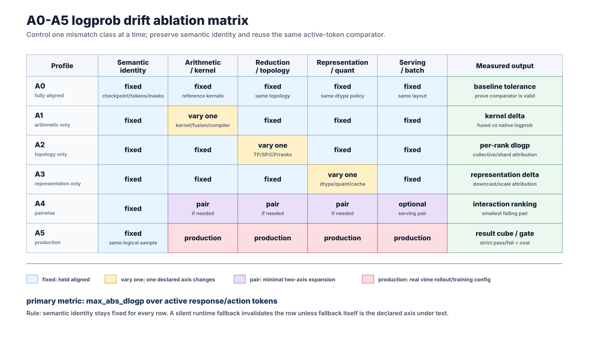
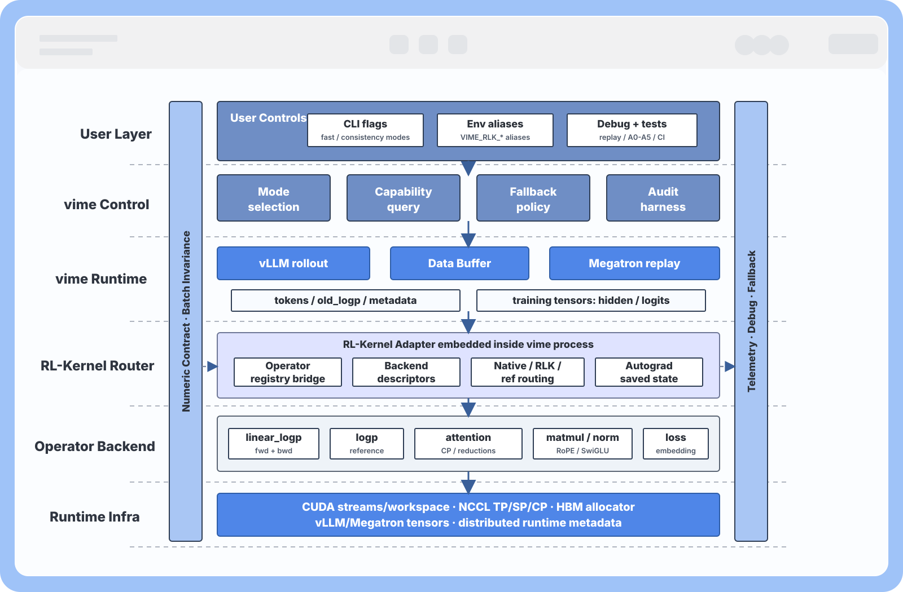

# RL-Kernel and vime Integration Roadmap

This roadmap proposes a concrete integration between vime and RL-Kernel. vime remains the RL orchestration framework: Megatron training, vLLM rollout, data buffer, reward flow, weight sync, scheduling, and algorithm-level behavior stay in vime. RL-Kernel becomes an optional, observable operator backend used in two modes:

1. **Fast Path**: reduce operator-level and system-level overhead when an RL-Kernel backend is eligible.
2. **Consistency Path**: make rollout-training consistency measurable, diagnosable, and enforceable through an explicit numeric contract.

The two goals are related but not automatically compatible. A fast implementation can run under strict consistency only when it preserves the same numeric contract as the reference implementation. Otherwise it can be used in `audit` mode, or it must fall back.

## Executive Summary

vime connects vLLM rollout with Megatron training. That architecture is the right place to solve two problems together:

- **Performance**: a full RL step is affected by selected-logprob computation, TP/NCCL communication, rank skew, host-side scheduling, GPU idle time, weight sync, and many small framework kernels.
- **Rollout-training consistency**: before parameters are updated, the log probabilities recorded during rollout and recomputed during training should match under the same checkpoint, token IDs, active masks, tokenizer, padding semantics, sampling metadata, position/cache metadata, quantization settings, and numeric contract.

The existing `linear_logp` integration proves that the boundary is practical. vime keeps orchestration and asks Megatron for hidden states; RL-Kernel computes selected logprobs from hidden states, LM head weights, target IDs, and TP metadata without exposing full logits at the Python framework layer.

This roadmap turns that proof point into a broader operator integration plan. The important change from a generic roadmap is that each operator now has a vime-facing integration surface: what vime records, where the operator is called, what metadata travels with rollout samples, what RL-Kernel reports, how fallback works, and which consistency checks gate strict mode.

## User Controls

Recommended public controls:

```bash
--rlk-fast {off,auto,strict}
--rlk-consistency {off,audit,strict}
```

Environment aliases:

```bash
VIME_RLK_FAST=off|auto|strict
VIME_RLK_CONSISTENCY=off|audit|strict
```

Migration from the current surface can be:

- `--enable-rl-kernel` implies `--rlk-fast auto`.
- `--rl-kernel-strict` maps to `--rlk-fast strict` for enabled operators.
- `--rl-kernel-ops linear_logp,...` remains the operator allowlist.
- `--rlk-consistency audit` can run without acceleration to measure native vime rollout-training drift.

The two switches are orthogonal:

| `--rlk-fast` | `--rlk-consistency` | Behavior |
|---|---|---|
| `off` | `off` | Native vime behavior. |
| `auto` | `off` | Use validated RL-Kernel optimized operators when eligible; warn and fall back otherwise. |
| `strict` | `off` | Require enabled RL-Kernel optimized operators; error when unavailable. |
| `off` | `audit` | Keep native vime execution, but compute and log consistency diagnostics. |
| `off` | `strict` | Require complete metadata and contract checks; fail on mismatch. |
| `auto` | `audit` | Use optimized operators when eligible and report consistency metrics. |
| `auto` | `strict` | Use only optimized operators that satisfy the consistency contract; otherwise use contract-preserving reference execution or fail according to policy. |
| `strict` | `strict` | Require both acceleration and strict consistency support for enabled operators. |

## Consistency Contract

Core metric:

```text
dlogp = training-side recomputed logp - rollout-side old logp
```

The metric is meaningful only when vime can guarantee the following comparison preconditions:

- same checkpoint or weight version;
- same token IDs for the compared samples;
- same sample-level active response/action mask;
- same tokenizer and padding semantics;
- same pre-update training state;
- same sampling metadata, including temperature, top-p, and top-k;
- same position IDs and KV/cache metadata;
- same quantization configuration;
- same operator numeric contract, including accumulation dtype, reduction order, downcast point, sharding semantics, and special merge semantics such as attention LSE;
- same batch-invariance contract when batch composition can affect tiling, padding, packing, split-K, cache layout, or reduction order.

All metrics are computed only on active response/action tokens. Prompt tokens, padding tokens, and masked-out response positions are excluded from every aggregate metric. The training-side value must come from teacher-forcing scoring of the already-sampled rollout sequence; the audit path must not resample or regenerate tokens.

The strict pass/fail gate should use RL-Kernel's per-dtype tolerance contract as the single source of truth, with `max_abs_dlogp` over active tokens as the primary thresholded metric. vime should not copy numeric tolerance values into its own docs or configs. `ratio0`, `clipfrac0`, `approx_kl0`, and percentile metrics are diagnostics and triage signals; they do not replace the selected-token `dlogp` contract.

Batch invariance is part of strict consistency. For a given sample/token, the recomputed logp and the training gradient contribution should not change when the same sample is scored alone, placed in a different batch, padded differently, packed in a different order, assigned to a different microbatch, or grouped by dynamic sampling differently, as long as the sample-level inputs and the declared contract are the same. If an optimized backend changes math based on batch composition, it can still run in `off` or `audit`, but it should not be advertised as `strict` until the batch-invariance contract is validated.

There are two levels of batch-invariance claims:

- **End-to-end strict consistency**: same-sample `dlogp` must stay within the per-dtype tolerance across the covered batch-layout matrix. This is the default production contract.
- **Deterministic operator claim**: an RL-Kernel backend that advertises deterministic/batch-invariant `logp` must prove same-backend bitwise stability for identical input bytes across batch size, row position, dense vs indexed rows, sparse-row density, stream/repeat runs, GPU architecture, and build fingerprint. Cross-backend or cross-platform parity can remain tolerance-based unless a separate bitwise contract is declared.

Minimum diagnostics:

- `abs_dlogp` mean, max, p50, p90, p99;
- `ratio0 = exp(dlogp)`;
- `clipfrac0`;
- `approx_kl0 = mean(exp(dlogp) - 1 - dlogp)`;
- active token count and mask coverage;
- batch layout fingerprint, including batch shape, sequence lengths, padding side, packed order, active-mask density, microbatch/global-batch identifiers, rollout ID, and dynamic-sampling group when available;
- per-rank versions for distributed runs;
- per-operator and per-stage attribution when available;
- worst-token metadata for the maximum absolute drift, including sample ID, token position, rank, model name, and backend contract ID when available;
- metadata fingerprint for checkpoint, tokenizer, sampling config, mask/padding semantics, position/cache metadata, quantization, and numeric contract.

This contract also defines the dependency order: single-card operator comparison first, then distributed operator comparison, then communication and topology sweeps. Distributed drift cannot be attributed until the corresponding single-card operator comparison passes.

## Drift Taxonomy and Alignment Strategy

The consistency plan should classify drift before proposing a fix. The useful source classes are:

- **Logical input and metadata drift**: checkpoint/version, tokenizer, token IDs, masks, padding side, position IDs, packed sequence metadata, cache positions, request formatting, or model routing differ. This invalidates the comparison.
- **Arithmetic schedule drift**: rollout and training compute equivalent expressions through different kernels, fusion orders, compiler rewrites, attention backends, matmul epilogues, or accumulation dtypes.
- **Reduction and collective drift**: local reductions, TP/SP/CP collectives, all-reduce, reduce-scatter, sharded logits, custom all-reduce, or rank topology change the floating-point reduction order.
- **Representation drift**: rollout and training use different dtype, quantization, dequantization, KV-cache precision, scale/group-size policy, or downcast point.
- **Serving and execution drift**: router policy, prefix cache, PD disaggregation, speculative decoding, vLLM scheduler shape, engine restart, or async rollout/training overlap changes the effective request provenance.

Use a minimal alignment ladder rather than forcing full bitwise parity:

1. **A0 fully aligned reference**: prove the base scoring path, masks, tokenizer, position metadata, and checkpoint identity are valid.
2. **A1 arithmetic-only mismatch**: vary kernel/fusion/compiler choices while logical inputs, reductions, and representation stay fixed.
3. **A2 reduction/topology-only mismatch**: vary TP/SP/CP, collectives, shard boundaries, and rank placement.
4. **A3 representation-only mismatch**: vary dtype, quantization, KV-cache precision, and dequantization placement.
5. **A4 pairwise mismatches**: test the smallest interacting pairs when single-source cases pass.
6. **A5 production mismatch**: run the real vime rollout/training setup.

<p align="center">
  
</p>

In vime this should be a profile/planner layer over the same audit harness: selecting A0-A5 changes declared axes, filters, and output location, but should not create six separate test implementations.

The preferred production fix is the smallest operator, collective, metadata, or representation alignment that brings the production case inside the tolerance contract while leaving unrelated high-performance rollout/training differences enabled.

## Fast and Consistency Compatibility

Fast and strict consistency are not automatically compatible. The integration should classify every RL-Kernel backend into three buckets:

- **Contract-preserving fast backend**: faster and satisfies the same numeric contract as the reference implementation. It may run with `--rlk-consistency strict`.
- **Opportunistic fast backend**: faster but not yet proven to satisfy the strict contract. It may run with consistency `off` or `audit`, but not `strict`.
- **Reference backend**: contract-first implementation used for fallback, debugging, and strict consistency when no validated fast backend exists.

Therefore `--rlk-fast auto --rlk-consistency strict` means: choose the fastest available backend that satisfies the consistency contract; otherwise use contract-preserving reference execution or fail according to policy. It does not mean always choose the fastest kernel.

`linear_logp` is the first contract-preserving fast candidate because its speedup comes from avoiding full-logits materialization and fusing selected-logprob computation, not from intentionally relaxing the math. It still needs explicit strict-mode checks for temperature, dtype/downcast behavior, TP vocab-shard merge, CP fallback, entropy fallback, and full-gradient coverage.

## vime Integration Model

RL-Kernel should not become a second orchestration layer. The integration surface in vime should be four concrete hooks:

1. **Mode selection**
   - vime parses `--rlk-fast`, `--rlk-consistency`, and `--rl-kernel-ops`.
   - vime decides whether an operator call is native, optimized, audit-only, strict-reference, or strict-fast.
   - Every decision is logged with operator name, backend, contract ID, reason, and fallback status.

2. **Capability reporting**
   - RL-Kernel reports supported operators, stable backend IDs, concrete implementation selected, dtypes, hardware targets, autograd modes, parallel modes, shape ranges, deterministic/batch-invariant properties, and numeric contracts.
   - Backend descriptors include runtime/build fingerprint, configuration lifecycle, required TP/SP/CP metadata, fallback behavior, and whether the backend is production, reference, deterministic, or strict-fast eligible.
   - vime never guesses support from imports or environment variables alone.

3. **Rollout sample metadata**
   - vime records compact fingerprints on samples: weight version, tokenizer, sampling config, active masks, padding semantics, position/cache metadata, quantization, parallel placement, and logprob numeric contract.
   - Metadata should be compact by default, with verbose replay dumps only for debugging.

4. **Operator-level contract and telemetry**
   - Each enabled operator exposes a contract: accumulation dtype, reduction order, downcast point, sharding rule, merge semantics, and quantization policy.
   - Telemetry reports operator time, memory deltas, requested backend, actual backend, fallback count/reason, contract fingerprint, `dlogp` attribution, and per-rank drift.

## vime Layered Architecture View

The integration should be drawn as a vime-native layered architecture rather than as a separate RL-Kernel controller. User controls enter vime; vime owns mode selection, rollout, Data Buffer, teacher-forcing replay, batching, routing metadata, audit, and fallback policy. RL-Kernel is embedded as an operator backend behind a vime adapter.

<p align="center">
  
</p>

Read this top-down:

- **User layer**: public CLI flags, environment aliases, debug dumps, train-only replay, A0-A5 profiles, and batch-invariance CI are vime-facing controls. They configure vime behavior rather than calling RL-Kernel directly.
- **vime control and runtime layers**: vime decides native/audit/strict/fast mode, queries RL-Kernel capabilities, records provenance, builds rollout/training batches, and owns fallback behavior.
- **RL-Kernel routing layer**: the embedded adapter maps vime operator calls to native, RL-Kernel optimized, RL-Kernel reference, or fallback implementations, with explicit autograd saved-state policy.
- **RL-Kernel backend layer**: `linear_logp`, `logp`, attention/reductions, matmul, normalization, RoPE, SwiGLU, embedding, and RL loss backends report contracts and telemetry back to vime.
- **Cross-cutting rails**: numeric contract, batch invariance, provenance, trace/debug artifacts, metrics, and fallback reasons must span every layer instead of living in a side script.

## Audit Harness and Provenance Model

vime does not need to adopt RL-Kernel's full experiment controller to get value, but the roadmap should preserve the same discipline: every consistency claim must be backed by typed identity, requested configuration, actual runtime provenance, and reusable artifacts.

Recommended vime-side records:

- `SemanticIdentity`: checkpoint/weight version, tokenizer fingerprint, fixed token IDs, selected response/action token IDs, masks, padding/layout semantics, position/cache metadata, model name, and weight-update state.
- `ScorerSpec`: rollout scorer or Megatron training-side scorer, world size, TP/SP/CP/DP placement, dtype, quantization, engine/router topology, and immutable engine-construction settings.
- `KnobDefinition`: one declared axis of variation, tagged as request-time, engine-construction, process-start, or build-time. Examples include rollout TP, Megatron TP/SP/CP, attention backend, logp backend, router policy, prefix cache, dtype, quantization, and deterministic logp policy.
- `AlignmentSample`: logical tensors, rollout `old_logp`, training recomputed logp, masks, sample IDs, rank metadata, and compact runtime provenance.
- `AlignmentResult`: global/per-rank metrics, pass/fail status, worst-token metadata, actual applied knobs, fallback status, and optional cost metrics.

Strict/audit runs must compare requested and actual provenance. A silent runtime fallback is invalid unless fallback itself is the declared knob under test. Cases can be indexed as a result cube over normalized axes such as batch size, padding/layout, dtype, cache policy, router policy, TP/SP/CP, logp backend, and deterministic policy. vime's existing debug rollout dumps and train-only replay paths are the natural artifact layer for these records.

## Data Buffer and Custom Rollout Compatibility

The integration must match vime's documented architecture, where rollout data can come from the default vLLM rollout function, a full `--rollout-function-path` replacement, a lighter `--custom-generate-function-path`, dynamic sampling, partial rollout, multi-model `--vllm-config`, or external rollout engines. RL-Kernel should not assume that every rollout sample was produced by the default vLLM path.

Required additions:

- **Metadata lives on vime samples and the Data Buffer**: consistency fingerprints should travel with `Sample` objects and survive Data Buffer storage, filtering, dynamic sampling, and partial-rollout continuation.
- **Custom rollout contract**: custom rollout/generate functions should either provide the fields needed for audit, or vime should report a structured "missing consistency metadata" reason and disable strict consistency for that sample.
- **Sample fields that matter**: `tokens`, `response_length`, `loss_mask`, `status`, `reward`, `rollout_id`, `session_id`, sampling params, finish/truncation reason, old logp source, model name, router/engine identity when available, and weight version.
- **Batch-invariance metadata**: vime should record enough batch construction metadata to replay the same sample alone or inside alternative batches: sequence lengths, padding side, packed order, active-token density, microbatch ID, global-batch shape, rollout/group ID, and dynamic-sampling keep/drop decisions when available.
- **Batch construction is not a semantic input by default**: dynamic sampling, partial rollout, filtering, and packing can change neighboring samples. Strict consistency should treat those changes as layout variation, not as a reason for the same sample's logp or gradient to drift, unless the algorithm explicitly defines a batch/group-level quantity.
- **Fan-out samples and group semantics**: custom agentic generation can return multiple `Sample` objects for one rollout. Sibling samples should keep shared `rollout_id` or group metadata so train-step splitting, loss aggregation, and batch-invariance tests do not accidentally treat group-level algorithm semantics as independent-sample drift.
- **Multi-turn and agentic workflows**: session affinity and `sample.session_id` can affect KV cache reuse and paged-attention metadata, so they should be included in replay/debug metadata when consistency audit is enabled.
- **Router and engine topology**: vime should record router policy, routed engine/server-group identity, `--rollout-num-gpus-per-engine`, worker type, prefix-cache policy, vLLM scheduler knobs such as max batched tokens/sequences when available, and whether the run uses regular serving, PD disaggregation, co-located training/rollout, decoupled rollout GPUs, or external engines.
- **`--vllm-config` and multi-model serving**: actor, reference, and reward models can have separate routers, heterogeneous server groups, and different `update_weights` settings. Contract fingerprints must be keyed by model name and server-group topology. Actor logp uses the synced actor weight version; reference/reward scoring uses frozen model fingerprints when `update_weights: false`.
- **External rollout engines**: strict consistency is available only when the external engine returns old logp and the required metadata fingerprints. Otherwise vime can still run fast operators, but consistency should be `off` or `audit` with an explicit missing-metadata report.
- **Async and fault-tolerant rollout**: async training, rollout-only debug dumps, train-only replay, engine health restarts, and post-restart weight sync should carry generation IDs and engine lifecycle fingerprints. A replay artifact should say whether it came from live rollout, debug rollout load, or a restarted engine.
- **Megatron extension hooks**: RL-Kernel logprob integration should preserve the order of vime's custom Megatron hooks, especially `--custom-megatron-before-log-prob-hook-path`, because those hooks may mutate state before logprob recompute.
- **Argument namespace**: `--rlk-fast` and `--rlk-consistency` should be framework-level vime flags. They should not be mixed into `--vllm-*` engine arguments or Megatron arguments.

## Operator Integration Plan

The following section is the core of this roadmap: concrete vime integration points for each operator family.

### `linear_logp` / `lm_head + logp`

**Why it matters**

This is already the proven integration point. PPO/GRPO style training needs log probabilities for selected tokens, while the native path often materializes full `[tokens, vocab]` logits.

**vime hook**

- Training-side logprob recompute asks Megatron for hidden states instead of materialized logits.
- vime passes hidden states, target token IDs, active masks, LM head weight, TP group, local vocab start, global vocab size, dtype, and rollout temperature to RL-Kernel.
- vime treats `linear_logp` as a forward-plus-backward training operator, not a forward-only scoring helper. The forward call returns selected logp and keeps the backward context needed by autograd.
- vime compares recomputed logp with rollout `old_logp` through `dlogp`.
- vime logs backend choice, fallback reason, token count, forward/backward CUDA time, memory probe, saved-state policy, and contract fingerprint.

**RL-Kernel backend**

- `FusedLinearLogpSM90Op` computes selected logprob directly from hidden states and LM head weights, while saving the backward state needed for full-gradient training.
- Backward still needs full-vocab local logits/probability information to form dlogits and compute gradients. The difference is where that information lives: the fast backend keeps it as operator-owned saved state or workspace, such as local/tiled logits, target-logit statistics, max/sum-exp statistics, softmax state, or dlogits buffers, rather than returning a framework-visible full `[tokens, vocab]` logits tensor to vime.
- TP support should make vocab-shard merge explicit: local max, global max, local sum-exp, global sum-exp, selected target logit, and final downcast point.
- Strict mode requires the same max/sum-exp contract between training and rollout-side scoring.

**Fast target**

- Avoid exposing full logits as a framework-level forward intermediate, while saving the operator-owned full-vocab state needed by backward so it does not have to rerun the output layer/logits path.
- Reduce HBM traffic and allocator pressure.
- Keep full-gradient forward/backward support and TP metadata visible.

**Consistency target**

- `max_abs_dlogp` over active response/action tokens stays within the RL-Kernel per-dtype tolerance contract in zero-update runs.
- Batch-invariant selected logp and gradients for the same sample under single-sample, mixed-batch, padding/packing, and active-mask-density variants. Any tile or split policy that depends on batch shape must be fixed by contract, recorded for audit, or rejected in strict mode.
- Explicit failure or reference fallback for unsupported CP redistribution, entropy requests, unsupported dtype, missing TP metadata, temperature mismatch, or unsupported backward saved-state policy.

### `logp` Reference Scoring

**Why it matters**

`logp` is the audit/reference sibling of `linear_logp`. It is useful when logits already exist, when full-vocab diagnostics are needed, or when strict consistency requires a simpler reference implementation.

**vime hook**

- vime uses it in audit mode to recompute selected-token logp from logits produced by the training model.
- vime records which implementation computed the training-side recomputed logp: native vime logits plus log-softmax, RL-Kernel `logp` on existing logits, or fused RL-Kernel `linear_logp` from hidden states and LM head weights.
- The same active mask, temperature, tokenizer, and padding metadata must be used as for `linear_logp`.

**RL-Kernel backend**

- Provide a numerically explicit log-softmax contract: max reduction dtype/order, sum-exp dtype/order, and downcast point.
- Provide a stable `deterministic` logp policy for strict/audit cases that require batch-invariant evidence. A deterministic backend should use a fixed row-local reduction topology, fixed launch configuration for the declared shape class, explicit math mode, and no undeclared switch to online, SM90/TMA, CUB, or autotuned variants.
- The backend descriptor should distinguish `production`, `reference`, and `deterministic` policy from the concrete implementation class selected by `KernelRegistry`.
- Share diagnostic output with `linear_logp` so both paths can be compared on the same rollout batch.

**Fast target**

- Secondary. This path is mainly a reference and diagnostic path.

**Consistency target**

- Acts as the first fallback when fused `linear_logp` is unavailable but strict consistency is requested.
- The log-softmax reduction contract is token-local and batch-invariant: changing neighboring rows, padding rows, or packed order must not change selected logp for an unchanged token.
- Deterministic `logp` tests should cover repeat runs, batch size changes, row-position changes, dense vs indexed rows, sparse-row density, and same-build same-backend bitwise equality when that property is advertised.

### Attention

**Why it matters**

Attention is the highest-impact single-card drift source in the consistency analysis. Training typically uses flash attention over full sequences; rollout uses vLLM paged attention, chunked prefill, and KV cache. Online-softmax merge order, block layout, and cache metadata can change logprob even before distributed communication is considered.

**vime hook**

- vime records position IDs, sequence lengths, attention mask semantics, KV cache block layout, chunked-prefill settings, paged-attention metadata, prefix-cache policy, speculative-decoding policy when enabled, router/server-group identity, CP degree, and cache reuse boundaries on rollout samples or replay metadata.
- In audit mode, vime replays rollout tokens through training-side teacher forcing and reports attention-attributed drift when instrumentation is enabled.
- For strict mode, vime requires the training and rollout attention paths to declare compatible LSE merge semantics.

**RL-Kernel backend**

- Provide a deterministic attention merge contract, especially for CP: `(out, lse)` buffers use fp32, merge order follows global block index, and token order is restored before merge.
- The same merge kernel or the same merge contract should be used for training-style and inference-style attention.
- Shape and cache-layout support must be reported through capability discovery.

**Fast target**

- Later-stage target. Attention fast path should focus on CP/LSE merge efficiency and avoiding hidden synchronization, not merely swapping kernels.

**Consistency target**

- Single-card: full attention vs paged/chunked attention replay.
- Batch-invariant replay for the same request under different batch companions, chunk schedules, padding/packing layouts, and active-token densities.
- Distributed: CP sweep with fixed global-block merge order and per-rank `dlogp`.

### Matmul Projections

**Why it matters**

QKV, output projection, gate/up/down projection, and some LM head paths are all matmuls. They drift when training and inference choose different GEMM kernels, split-K policies, accumulation dtypes, quantization policies, or TP reduction structures. Row-parallel matmul is a direct source of TP mismatch when its reduction order or accumulation dtype differs across training and rollout.

**vime hook**

- vime exposes train/infer role tags for projection operators under audit tests.
- vime provides TP group, tensor-parallel shard layout, local/global feature ranges, quantization config, and split-K policy if present.
- vime logs whether a projection output is replicated, sharded, or a partial value that requires reduction.

**RL-Kernel backend**

- Provide projection backends with explicit sharding rules.
- For row-parallel matmul, output is partial and must go through a contract-preserving reduction.
- The reduction contract should include fp32 accumulation, fixed logical order, final downcast, and whether reduction is in-op, NCCL, or custom.
- Quantized matmul must include scale/zero-point policy in the contract.

**Fast target**

- Improve hot projection kernels only when profiling shows they are material.
- Reduce repeated small GEMM launches and support communication overlap only after correctness contracts are explicit.

**Consistency target**

- Single-card train-style GEMM vs infer-style GEMM.
- Batch-invariant grouped-GEMM and split-K behavior: strict mode either fixes the policy, records it as part of the contract, or falls back when batch shape changes the reduction path.
- Distributed TP sweeps at TP=1/2/4/8 for row-parallel reductions.

### RMSNorm

**Why it matters**

Single-layer error is small, but RMSNorm occurs many times and can accumulate. Training may use an unfused implementation, while inference may fuse RMSNorm with residual operations. Under SP, the reduction may happen at the boundary rather than inside the norm operator.

**vime hook**

- vime records RMS epsilon, residual fusion status, hidden shape, dtype, SP degree, and sequence shard layout.
- vime tracks Megatron SP boundary collectives, especially all-gather and reduce-scatter around sequence-parallel regions.

**RL-Kernel backend**

- Implement the missing CUDA RMSNorm backend before using it as a fast path.
- Contract: fp32 square-sum accumulation across hidden dimension, fixed local order, final downcast.
- SP contract: RMSNorm itself may be sharded by sequence with no internal cross-rank reduction, but boundary collectives must still follow a numeric contract.

**Fast target**

- Fused CUDA RMSNorm after the reference contract is in place.

**Consistency target**

- Single-card fused vs unfused comparison.
- Same-token RMSNorm output must be invariant to sequence packing, padding rows, and microbatch composition.
- SP boundary test for token order, reduce-scatter dtype, and global sequence reconstruction.

### RoPE

**Why it matters**

RoPE usually has smaller drift, but position metadata errors create false mismatches. Differences in sin/cos precision, rotary base/scaling, interleaved vs half-rotation layout, and cache offsets can break rollout-training parity.

**vime hook**

- vime records rotary base, scaling policy, position IDs, cache offsets, layout, and any model-specific RoPE overrides from the Megatron config and vLLM config.
- Audit mode checks these metadata fields before attributing drift to kernels.

**RL-Kernel backend**

- Provide a shared RoPE contract for table precision, layout, and dtype/downcast.
- Acceleration is optional; the main goal is to prevent hidden metadata drift.

**Fast target**

- Low priority unless profiling shows RoPE as a launch-pressure contributor.

**Consistency target**

- Metadata validation first, then train/infer kernel comparison.

### SwiGLU

**Why it matters**

SwiGLU can drift through fusion order: gate activation, up projection, multiply, and down projection may be fused differently in training and inference.

**vime hook**

- vime records activation variant, fusion status, dtype, and the associated MLP projection contracts.
- Operator attribution should separate projection drift from activation/multiply drift.

**RL-Kernel backend**

- Provide a deterministic fused SwiGLU path only after unfused train/infer comparison is available.
- Contract includes activation approximation, multiplication dtype, accumulation dtype for any fused reduction, and downcast point.

**Fast target**

- Reduce small elementwise launch pressure after communication and projection bottlenecks are addressed.

**Consistency target**

- Single-card fused vs unfused comparison, then integration into the full forward-chain drift test.
- Same hidden rows must produce the same fused/unfused SwiGLU result regardless of neighboring rows or grouped-kernel batching.

### Embedding

**Why it matters**

Embedding is usually a metadata guard rather than a numeric bottleneck. It is where tokenizer, vocabulary mapping, padding, and token ID assumptions enter the model.

**vime hook**

- vime records tokenizer fingerprint, vocab size, special token IDs, padding side, prompt/response boundary, and active mask.
- Audit mode checks embedding inputs before running expensive operator attribution.

**RL-Kernel backend**

- Acceleration is not a first target.
- Provide a simple reference check that token IDs and vocab mapping are identical across rollout and training.

**Fast target**

- None initially.

**Consistency target**

- Prevent false `dlogp` drift caused by tokenizer, padding, or mask mismatch.

### RL Loss Operators: `ratio_kl`, GRPO/PPO/DPO Loss Fragments

**Why it matters**

Once logp is computed, RL losses consume `old_logp`, `new_logp`, masks, rewards, advantages, KL terms, and clipping rules. Fast loss kernels are useful, but they must not hide logp mismatch or mask semantics.

**vime hook**

- vime owns algorithm semantics: advantage calculation, reward normalization, KL coefficient, clipping range, per-token/per-sample aggregation, and mask semantics.
- vime passes only well-defined tensor inputs to RL-Kernel loss fragments.
- vime logs loss sanity metrics next to `dlogp` diagnostics.

**RL-Kernel backend**

- Provide optional fused `ratio_kl` and loss fragments for launch reduction.
- Contract includes mask handling, aggregation level, dtype, reduction order, and output dtype.

**Fast target**

- Fuse high-count elementwise/reduce loss fragments after profiling shows launch pressure.

**Consistency target**

- Loss kernels must consume the same `old_logp`/`new_logp` tensors that passed consistency checks.
- Per-token loss fragments should be batch-invariant after vime has computed algorithm-level tensors. Batch/group-level semantics such as GRPO group normalization remain vime-owned and must be identified by group metadata rather than hidden inside RL-Kernel kernels.

### Communication and Distributed Reductions

**Why it matters**

TP/NCCL AllReduce and rank skew dominate the captured actor training window, while `linear_logp` itself is not the end-to-end bottleneck. Communication should be treated as part of distributed operator semantics, not as an external issue.

**vime hook**

- vime records TP/SP/CP groups, rank placement, tensor shard layout, collective count/time, rank skew, overlap status, and whether custom all-reduce is enabled.
- vime adds NVTX ranges for rollout wait, forward, logprob, backward, optimizer, weight sync, and communication.
- vime separates initialization noise from steady-state profiling.

**RL-Kernel backend**

- Provide contract-preserving reduction helpers for in-op deterministic reduction when strict consistency requires it.
- For fast mode, report communication capability separately from numeric strictness: bucket/fusion/overlap may be fast but not automatically strict.
- Custom all-reduce must be explicit in the contract.

**Compute/communication decoupling**

- The goal is not to hide communication at any cost. It is to make compute kernels, collective scheduling, and host orchestration independently observable and independently selectable.
- vime should model a distributed operator as a compute segment, a communication segment, and an explicit dependency boundary. Telemetry should record stream/event plan, bucket assignment, overlap window, outstanding NCCL work, and fallback reason when overlap is disabled.
- RL-Kernel may provide fused compute+reduction helpers or communication-aware reduction backends, but backend descriptors must expose whether communication is in-op, post-op NCCL, custom all-reduce, or an overlapped bucket, and whether the overlap policy is strict-eligible.
- Strict consistency freezes the logical reduction order and declared bucket boundaries. If overlap or fusion changes reduction grouping or rank order, it must be an explicit axis in audit/A0-A5 rather than a silent fast-path choice.

**Fast target**

- Reduce AllReduce count and latency.
- Improve bucketing/fusion and overlap.
- Evaluate TP=1/DP alternatives for latency-bound small models.

**Consistency target**

- Sweep TP/SP/CP degrees, NCCL algorithm/protocol, custom all-reduce on/off, and dtype.
- Distributed batch-invariance sweeps should keep one sample fixed while changing batch layout, microbatch partitioning, rank placement, and active-token density.
- Strict mode requires fixed logical reduction order or a documented reference fallback.

## Phased Roadmap

### Phase 1: Contract and Telemetry Layer

Deliverables:

- Add `--rlk-fast` and `--rlk-consistency` parsing.
- Add structured execution-decision records.
- Add RL-Kernel capability query.
- Add RL-Kernel per-dtype tolerance lookup without copying threshold values into vime.
- Add compact rollout metadata fingerprints.
- Add a Data Buffer-compatible metadata schema for default rollout, custom rollout, dynamic sampling, and partial rollout.
- Add batch-layout fingerprints for strict/audit replay: sequence lengths, padding/packing, active-token density, microbatch/global-batch shape, and dynamic-sampling group IDs.
- Add requested-vs-actual provenance records for backend, router, engine topology, dtype, quantization, parallel placement, and lifecycle-sensitive knobs.
- Add contract IDs to `old_logp` and recomputed logp.
- Add audit-only `dlogp` diagnostics without enabling fast operators.

Acceptance criteria:

- Native vime behavior is unchanged when both switches are `off`.
- Audit mode can run on native vime and report `dlogp` metrics.
- Custom rollout samples without required metadata produce structured audit warnings rather than silent strict-mode claims.
- Strict/audit reports identify active-token count, zero-active-token cases, and the worst-token location for `max_abs_dlogp`.
- Every operator decision is explainable from logs.

### Phase 2: Productionize `linear_logp`

Deliverables:

- Keep the existing hidden-state-to-selected-logprob integration, including the saved backward state needed by the full-gradient path.
- Document support matrix: dtype, hardware, TP, CP, entropy, full-gradient support, backend.
- Add strict checks for temperature, active mask, TP metadata, dtype/downcast, and fallback.
- Preserve native fallback and make strict fallback behavior testable.

Acceptance criteria:

- Validated configurations have `fallback=0` under strict fast mode.
- Unsupported configurations either fall back with a structured reason or fail under strict policy.
- Operator-level timing and memory claims remain separate from full-step claims.

### Phase 3: Consistency Audit Harness

Deliverables:

- Implement shared `dlogp`, `ratio0`, `clipfrac0`, `approx_kl0`, and percentile metrics.
- Implement a read-only teacher-forcing scoring path that does not resample, regenerate, run optimizer steps, or mutate model state during audit replay.
- Add replay/debug dumps for selected rollout batches.
- Add per-rank diagnostics.
- Add metadata validation for checkpoint, tokenizer, masks, padding, sampling settings, position/cache metadata, quantization, rollout ID, session ID, model name, and weight-update status.
- Add requested-vs-actual provenance validation and reject undeclared fallback in strict cases.
- Add batch-invariance replay cases for same sample alone vs mixed batch, padding/packing variants, active-token-density variants, and dynamic-sampling keep/drop variants.
- Add a lightweight result-cube output indexed by normalized axes such as batch layout, dtype, router policy, cache policy, TP/SP/CP, logp backend, and deterministic policy.

Acceptance criteria:

- A zero-update single-GPU run reports `max_abs_dlogp` within the RL-Kernel per-dtype tolerance over active response/action tokens.
- Known metadata mismatch is caught before operator drift is blamed.
- Same-sample `dlogp` remains within tolerance across the batch-layout replay cases covered by the declared contract.
- Audit mode does not change training behavior.

### Phase 4: Single-Card Operator Integration

Deliverables:

- Add train/infer role pairing for `attention`, `lm_head/logp`, matmul projections, RMSNorm, RoPE, SwiGLU, embedding, and RL loss fragments.
- Fill missing reference implementations needed for comparison, especially CUDA RMSNorm.
- Expand operator tests from pass/fail tolerances to drift attribution metrics.
- Add a forward-chain test to measure how small operator drift accumulates across layers.
- Treat the forward-chain test as an audit/CI/backend-admission test, not a per-operator preflight that runs before every production call.
- Add operator-level batch-invariance tests for single-sample vs mixed-batch execution, padding/packing layouts, and active-mask-density changes.
- Add deterministic `logp` bitwise tests for same-backend same-build repeatability when the backend advertises that property.

Acceptance criteria:

- Every target operator can run a single-card train-vs-infer comparison.
- A strict backend is not advertised until same-sample outputs and gradients pass the relevant batch-invariance tests.
- Operator-level drift attribution is visible before distributed tests run.

### Phase 5: Distributed Operator Contracts

Deliverables:

- Add TP matmul projection tests.
- Add SP RMSNorm boundary tests.
- Add CP attention LSE-merge tests.
- Generalize `linear_logp` TP tests into a cross-configuration drift harness.
- Add distributed batch-invariance sweeps across TP/SP/CP, microbatch partitioning, rank placement, and packed-batch layouts.
- Add A0-A5 named profiles for fully aligned reference, arithmetic-only, reduction/topology-only, representation-only, pairwise, and production mismatch runs.
- Add contract-preserving reduction helpers where strict consistency needs them.

Acceptance criteria:

- Distributed tests run only after corresponding single-card tests pass.
- TP/SP/CP drift can be attributed to sharding, reduction order, dtype, custom all-reduce, or metadata mismatch.
- Strict distributed runs keep same-sample `dlogp` within tolerance across supported batch-layout variants.
- The report names the smallest alignment set that passes, rather than requiring full reference execution by default.
- Strict consistency has a documented reference path.

### Phase 6: Fast Path Expansion From Profiling Bottlenecks

Deliverables:

- Clean warmup and stable-window profiling scripts.
- NVTX ranges for rollout, train compute, logprob, backward, optimizer, weight sync, and communication.
- Communication metrics: AllReduce/AllGather count and time, rank skew, overlap, and topology notes.
- Compute/communication segment telemetry: compute time, exposed communication time, overlapped communication time, idle/wait time, stream/event plan, and overlap fallback reason.
- Fast-path work for TP communication and high-count small elementwise/reduce/copy kernels.
- Additional RL-Kernel operators only when they are hot in profiling and have a clear consistency contract.

Acceptance criteria:

- Fast work targets measured bottlenecks, not just convenient kernels.
- Communication overlap or bucket fusion is not labeled strict unless reduction order and bucket-boundary contracts are covered.
- Full-step speedup claims include rollout, communication, weight sync, and host scheduling.
- `linear_logp` remains a strong operator proof point but is not overclaimed as the full end-to-end bottleneck.

### Phase 7: CI, Benchmarks, and Release Rules

Deliverables:

- Unit tests for config parsing and fallback decisions.
- CPU reference tests for diagnostic math.
- GPU operator tests for supported backends.
- Distributed tests for TP/SP/CP contracts.
- Batch-invariance tests for same-sample replay across batch size, padding/packing, active-mask density, dynamic sampling, and microbatch partitioning.
- Named A0-A5 grid slices using the same result-cube/report path as local audit runs.
- Scheduled benchmark matrix for representative vime workloads.
- Report template separating operator-level, actor-window, and full-step claims.

Release rules:

- Operator-level speedups can be published as operator-level speedups.
- Full-step speedups require full-step measurements.
- Consistency claims must state whether the mode is audit, tolerance-based strict, or bitwise strict.
- Strict consistency claims must state the covered batch-invariance matrix.

## Suggested PR Sequence

1. **Roadmap and user controls**
   - Land the two-switch model and the operator integration plan.

2. **Execution decision and capability reporting**
   - Add `--rlk-fast`, `--rlk-consistency`, capability query, backend descriptors, and structured fallback records.

3. **`linear_logp` productionization**
   - Finish strict checks, support matrix, docs, and tests.

4. **Consistency audit core and provenance**
   - Add `dlogp` metrics, tolerance lookup, metadata fingerprints, teacher-forcing replay, requested-vs-actual provenance, and audit-only execution.

5. **Single-card operator comparisons**
   - Add train/infer role pairing for the forward-chain operators and deterministic `logp` bitwise batch-invariance tests.

6. **Distributed operator contracts**
   - Add TP matmul, SP RMSNorm, CP attention, generalized TP `linear_logp` tests, and A0-A5 named profiles.

7. **Profiling and fast-path expansion**
   - Add clean profiling ranges and compute/communication segment telemetry, then target TP communication and launch-heavy paths.

8. **Release and CI matrix**
   - Stabilize tests, benchmark reports, and compatibility aliases.

## Ownership Split

vime side:

- user-facing flags and config;
- mode-selection policy;
- rollout sample metadata;
- requested-vs-actual runtime provenance;
- native fallback behavior;
- read-only teacher-forcing replay diagnostics;
- debug rollout/train-only replay artifacts;
- structured execution records;
- compute/communication segment telemetry and overlap fallback records;
- benchmark entry points;
- docs and examples.

RL-Kernel side:

- operator implementations;
- backend capability reporting;
- backend descriptors with deterministic/batch-invariant properties;
- numeric contract metadata;
- per-dtype tolerance contract;
- reduction and sharding helpers;
- communication-aware reduction backends and overlap-capability descriptors;
- cross-implementation operator tests;
- deterministic `logp` bitwise invariance tests;
- hardware-specific dispatch;
- operator-level benchmark tooling.

Joint:

- support matrix;
- benchmark matrix;
- CI coverage;
- release notes;
- strict-mode contract definitions;
- A0-A5 alignment profiles and result-cube schema;
- bucket-boundary and reduction-order contracts for overlap;
- fallback and telemetry semantics.

## Non-Goals

- Do not replace Megatron or vLLM.
- Do not make RL-Kernel mandatory for vime.
- Do not silently change native vime numerics.
- Do not claim full-step speedup from isolated operator measurements.
- Do not hide unsupported cases behind unobservable fallback.
- Do not require strict bitwise consistency before offering audit mode.
- Do not copy RL-Kernel tolerance values into vime; consume the contract instead.
- Do not require full internal bitwise alignment when selected-token `dlogp` already satisfies the strict tolerance contract.

## Risks and Mitigations

| Risk | Mitigation |
|---|---|
| Fast kernels change numerics | Gate strict mode on explicit contracts and audit diagnostics. |
| Too many flags confuse users | Keep two public switches and move operator details to advanced docs. |
| Fallback hides missing coverage | Structured fallback reasons, strict policy, and support matrix. |
| Profiling captures initialization noise | Mandatory warmup and stable-window traces. |
| TP communication dominates after operator fusion | Treat communication as a fast-path target with its own telemetry. |
| Metadata bloats rollout samples | Store compact fingerprints by default; enable verbose dumps only for replay. |
| Distributed drift is misattributed | Require single-card operator comparison before distributed sweeps. |
| Custom all-reduce diverges from training | Make reduction engine explicit and provide strict reference fallback. |
| Router or engine restarts make replay non-reproducible | Record router policy, engine/server-group identity, lifecycle generation, and post-restart weight version in replay metadata. |
| Batch-invariant claims become overstrong | Separate end-to-end tolerance-based strict consistency from same-backend bitwise deterministic operator claims. |
| Silent runtime fallback invalidates ablations | Compare requested and actual provenance; strict cases reject undeclared fallback. |
| Communication overlap changes reduction grouping | Treat bucket boundaries, stream/event dependencies, and reduction order as explicit contract fields before labeling overlap strict. |

## Desired End State

Users can run:

```bash
python train.py \
  --enable-rl-kernel \
  --rl-kernel-ops linear_logp \
  --rlk-fast auto \
  --rlk-consistency audit
```

and see exactly:

- which RL-Kernel operators ran;
- which operators fell back and why;
- whether the backend was opportunistic fast, contract-preserving fast, or reference;
- the requested backend and actual backend selected at runtime;
- which metadata fingerprints were compared;
- whether active-token `max_abs_dlogp` remained within the RL-Kernel per-dtype tolerance;
- the worst-token location and the covered batch-invariance matrix;
- which operator or stage contributed drift;
- which router/engine topology, cache policy, and weight version produced the rollout sample;
- whether end-to-end time is limited by kernels, communication, rollout, weight sync, or host scheduling.

For production or CI, users can tighten the same surface:

```bash
python train.py \
  --enable-rl-kernel \
  --rl-kernel-ops linear_logp,logp,attention,matmul,rms_norm \
  --rlk-fast strict \
  --rlk-consistency strict
```

The strict command should succeed only when every enabled operator has both backend support and a matching consistency contract. Otherwise vime should choose contract-preserving reference execution or fail according to policy.
