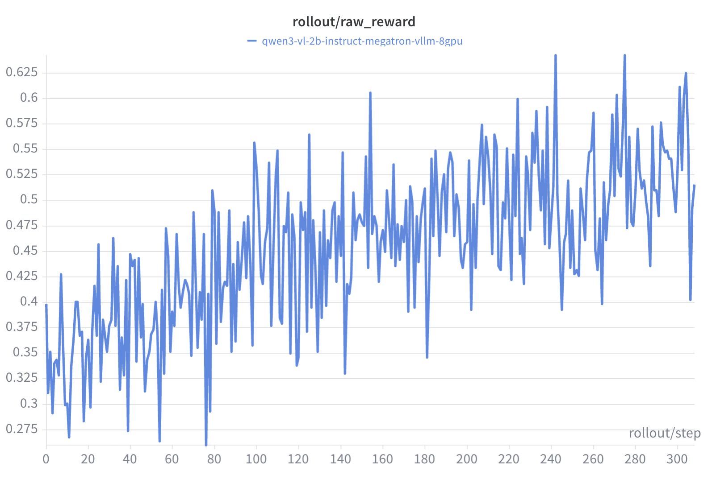

# VLM Single-Turn RL

Training VLMs with Megatron on single-turn reasoning task using GRPO on the [GEO3K dataset](https://huggingface.co/datasets/hiyouga/geometry3k). We used processed version [here](https://huggingface.co/datasets/chenhegu/geo3k_imgurl).

Supported models:
* Qwen3.5-35B-A3B

Note: Please make sure the cudnn version in the environment is 9.16.0.29 to prevent severe performance regression in conv3d in torch 2.9 mentioned in https://github.com/pytorch/pytorch/issues/168167. Otherwise, you can reinstall cudnn with:
```bash
pip install nvidia-cudnn-cu12==9.16.0.29
```

Qwen3.5 uses vime's native Megatron language model plus the Transformers vision model. Vision parameters retain their HuggingFace names and are loaded and synchronized directly.

<p align="center">
  
</p>

## Data Preparation (For SFT Training)

The [geo3k_imgurl](https://huggingface.co/datasets/chenhegu/geo3k_imgurl) dataset contains:
- `problem`: The math problem text (string)
- `answer`: The answer (string, e.g., "270")
- `images`: Image data (list)

For SFT training, we need to format the `answer` field for `\boxed{}` format and the messages. You can use the following script to format the answer field:

```python
from datasets import load_dataset
import pandas as pd

ds = load_dataset("chenhegu/geo3k_imgurl", split="train")

def format_answer(answer: str) -> str:
    """Format answer to include \\boxed{} format."""
    return f"Answer: \\boxed{{{answer}}}"

def process_sample(sample):
    formatted_answer = f"Answer: \\boxed{{{sample['answer']}}}"
    
    sample["messages"] = [
        {"role": "user", "content": sample["problem"]},
        {"role": "assistant", "content": formatted_answer}
    ]
    return sample

ds = ds.map(process_sample)
ds.to_parquet("/root/datasets/geo3k_imgurl/train_formatted.parquet")
```

## Reproduce

```bash
export WANDB_API_KEY=your_wandb_api_key

./examples/geo3k_vlm/run_geo3k_qwen35.sh
```

### Configuration

| Environment Variable | Default | Description |
|---------------------|---------|-------------|
| `VIME_SCRIPT_DATASET_NAME` | `chenhegu/geo3k_imgurl` | HuggingFace dataset name |
| `VIME_SCRIPT_NUM_GPUS` | `8` | Number of GPUs |
| `VIME_SCRIPT_EXTERNAL_RAY` | `0` | Use external Ray cluster (`1` to enable) |

#### Qwen3.5 Series
We provide a native [example](./run_geo3k_qwen35.sh) for Qwen3.5-35B-A3B. It loads the Transformers ViT directly and converts only the Megatron language-model parameters. To support another Qwen3.5 model, add its model config under `scripts/models/` and update the example.

The native path supports tensor, pipeline, context, sequence, and expert parallelism. Context parallelism follows Megatron's packed THD zigzag layout.

For GDN training, use `--micro-batch-size 1` and remove `--use-dynamic-batch-size`.

## Notes

### Reward Model Configuration

We experimented with three reward model configurations:
1. A geo3k-specific RM with tolerance=0.05 (to handle rounding in ground truth labels)
2. A geo3k-specific RM with tolerance=0.0 (strict matching)
3. The default math RM

All three performed similarly, so we use the default math RM for simplicity.

### Numerical Precision with Non-Binary Rewards

Our initial geo3k-specific verifier produced "format scores" (**0 and 0.9**) instead of clean binary rewards. Under **fp32**, fractional values like 0.9 can't be exactly represented, so when all samples in a group have the same reward, `reward - mean` doesn't equal zero—creating spurious gradient signal.

We fixed this by switching to the default math RM with clean **binary 0/1 rewards**. If you encounter similar precision issues with non-binary rewards, you can change the reward tensor dtype from `torch.float` to `torch.float16` in `vime/ray/rollout.py` (`_post_process_rewards` method) to truncate precision artifacts.

## B200
On Blackwell (SM100), vLLM automatically dispatches the ViT encoder to
FlashAttention 4 (or FA2 fallback) — no manual override is needed
([vllm/v1/attention/backends/fa_utils.py:81](https://github.com/vllm-project/vllm/blob/main/vllm/v1/attention/backends/fa_utils.py#L81)).
If you hit a kernel issue on a specific model, you can force SDPA with
`--vllm-mm-encoder-attn-backend TORCH_SDPA`. The HF-side
`--attn-implementation flash_attention_2` flag is still relevant when the
model is loaded via Hugging Face Transformers.
